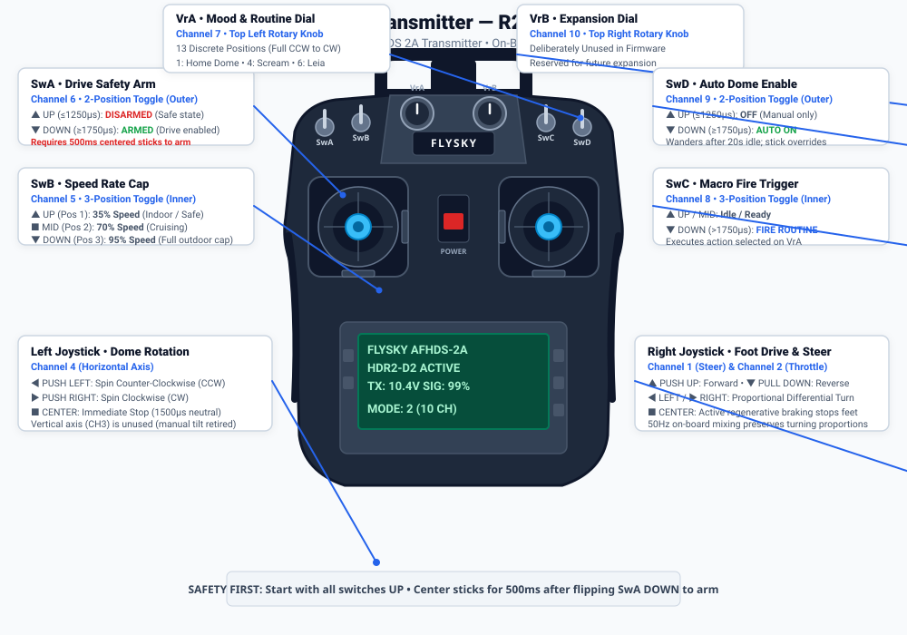

# FlySky FS-i6X Controller Layout & Operator Guide

> **Safety Notice:** Do not connect this wiring to the old ESP32-only firmware. Both the Teensy 4.1 body controller and AstroPixels Plus ESP32 firmware are fully implemented; flash both boards before combined testing.

This guide explains in plain language what every switch, knob, and stick on your **FlySky FS-i6X 10-Channel 2.4GHz Transmitter** does when operating R2-D2.

---

## 1. Visual Layout & Controls Overview



```
       [ SwA ] (2-pos)                         [ SwD ] (2-pos)
     Drive Safety Arm                        Auto Dome Enable
        UP: Disarmed                            UP: Manual only
       DOWN: Armed                             DOWN: Auto wandering
           \                                       /
      [ SwB ] (3-pos)                         [ SwC ] (3-pos)
     Speed Rate Cap                          Macro Fire Trigger
       UP: 35% (Slow)                          UP/MID: Armed/Idle
      MID: 70% (Cruise)                        DOWN: Fire Selected Macro
     DOWN: 95% (Full)                              \
           \         ( VrA )         ( VrB )       /
                     Mood/Macro       Unused
                      Selector        (CH10)
                      (13 pos)           |
                         \              /
            ┌──────────────────────────────────┐
            │   [Left Stick]    [Right Stick]  │
            │   Dome Rotation     Foot Drive   │
            │   ◄- CCW  CW -►   ◄-Turn  Turn-► │
            │                    ▲ Fwd   Rev ▼ │
            │                                  │
            │          ┌────────────┐          │
            │          │  LCD Screen│          │
            │          └────────────┘          │
            │          [Power Switch]          │
            └──────────────────────────────────┘
```

---

## 2. Quick Reference Summary Table

| Control | Type | iBus Channel | Function | Default Safe Position |
| :--- | :--- | :--- | :--- | :--- |
| **Right Stick (Y)** | Vertical Axis | **CH2** | **Forward / Reverse Drive** | Centered (Stop) |
| **Right Stick (X)** | Horizontal Axis | **CH1** | **Left / Right Steering** | Centered (Straight) |
| **Left Stick (X)** | Horizontal Axis | **CH4** | **Dome Rotation** (Left=CCW, Right=CW) | Centered (Stop) |
| **Left Stick (Y)** | Vertical Axis | **CH3** | *Unused* (Retired manual tilt) | Centered |
| **Switch SwA** | 2-Position Toggle (Top Left) | **CH6** | **Drive Safety Arm** (UP=Disarmed, DOWN=Armed) | **UP** (Disarmed) |
| **Switch SwB** | 3-Position Toggle (Inner Left) | **CH5** | **Speed Rate Cap** (UP=35%, MID=70%, DOWN=95%) | **UP** (35% Slow) |
| **Knob VrA** | Rotary Dial (Left Knob) | **CH7** | **Mood & Macro Selector** (13 Positions) | **Pos 1** (Dome Home) |
| **Switch SwC** | 3-Position Toggle (Inner Right) | **CH8** | **Macro Fire Trigger** (Flip DOWN to activate) | **UP** (Idle) |
| **Switch SwD** | 2-Position Toggle (Top Right) | **CH9** | **Auto Dome Enable** (UP=Off, DOWN=On) | **UP** (Off) |
| **Knob VrB** | Rotary Dial (Right Knob) | **CH10** | *Unused* (Reserved for expansion) | Any |

---

## 3. Plain Language Explanation of Controls

### 🕹️ Right Stick — Foot Drive & Steering
The right stick controls R2-D2's feet using single-stick arcade drive:
* **Push UP:** Drive forward.
* **Pull DOWN:** Drive in reverse.
* **Push LEFT:** Steer left (spins left wheel backward, right wheel forward when stationary).
* **Push RIGHT:** Steer right (spins right wheel backward, left wheel forward when stationary).
* **Release to Center:** Active regenerative braking stops both wheels immediately.
* **On-Board Mixing:** The Teensy 4.1 controller automatically mixes throttle and steering in real-time at 50Hz, scaling both wheels proportionally so turns remain smooth without spinning out or clipping.

---

### 🕹️ Left Stick — Dome Rotation
The left stick gives direct manual control over the dome's continuous rotation servo:
* **Push LEFT:** Spin dome counter-clockwise (CCW).
* **Push RIGHT:** Spin dome clockwise (CW).
* **Release to Center:** The dome halts and holds its position.
* **Speed Modulation:** The further you push the stick, the faster the dome spins. Gentle deflection gives smooth, slow cinematic rotation.
* **Up / Down Axis (CH3):** Unused. Manual holo projector tilt was retired to prevent servo strain; holos are automated.

---

### 🛡️ Switch SwA — Drive Safety Arm (Motion Interlock)
Located on the far top-left. This is your primary safety switch:
* **UP (<= 1250µs): DISARMED (Safe State)**  
  The motor controllers (VESCs) are completely inhibited. The droid will not move even if you bump the right stick. Always start with SwA UP.
* **DOWN (>= 1750µs): ARMED (Drive Enabled)**  
  Enables foot drive.
* **500ms Neutral Arming Interlock:**  
  To prevent unexpected movement, the controller will **not** arm if the stick is pushed while flipping the switch! You must:
  1. Have SwA UP.
  2. Leave the right stick completely centered.
  3. Flip SwA DOWN.
  4. Keep the stick centered for at least **500 milliseconds**.  
  Only then will drive engage. If a motor fault or radio hiccup occurs, SwA automatically disarms and requires repeating this sequence.

---

### ⚡ Switch SwB — Speed Rate Limiter (Dual Rates)
Located on the inner top-left. This 3-position toggle sets the maximum driving speed:
* **UP (Position 1, <= 1250µs): 35% Speed (Low / Safe Mode)**  
  Capped at 35% duty. Perfect for indoor driving, navigating crowded events, narrow doorways, and workbench testing.
* **CENTER (Position 2, ~1500µs): 70% Speed (Cruising Mode)**  
  Capped at 70% duty. Smooth, comfortable outdoor cruising speed.
* **DOWN (Position 3, >= 1750µs): 95% Speed (High Performance)**  
  Capped at 95% maximum electrical duty. Full acceleration and speed for open pavement.

---

### 🎭 Knob VrA — Mood & Routine Selector (13 Positions)
Located on the top face, left knob. Rotating this knob selects which sound, mood, or autonomous routine is queued:

| Position | Dial Turn | Routine Name | Sound / Action Description |
| :---: | :--- | :--- | :--- |
| **1** | Full CCW | **Home Dome** | Automatically rotates dome to 0° Front center using Hall sensor (`:DMH` + Track 11) |
| **2** | ~8% | **Movie Normal** | Standard inquisitive movie chatter (Bank 1) |
| **3** | ~16% | **Happy Melodic** | Cheerful, upbeat melodic trills and chirps (Bank 3) |
| **4** | ~25% | **Scream Routine** | Loud panic scream (`:SE01` + Track 107) with rapid holo-projector twitching and red LED flicker |
| **5** | ~33% | **Cantina Band** | Plays full *Cantina Band* song (`:SE05` + Track 106) with choreographed holo-projector dance |
| **6** | ~41% | **Princess Leia** | Auto-aligns dome forward to audience, then plays 1977 Leia distress message (`:SE08` + Track 102) with blue holo flicker |
| **7** | ~50% | **Star Wars Disco** | Upbeat disco celebration (`:SE09` + Track 108) with rainbow logic display animations |
| **8** | ~58% | **Short Circuit / Faint** | R2 plays power-down sound (`:SE06` + Track 110), logic lights black out, dome halts |
| **9–13** | ~66% to Full CW | **Chatter Banks** | Cycles through random astromech conversational whistle and chirp banks |

---

### 🎯 Switch SwC — Routine Trigger
Located on the inner top-right. This switch executes whatever routine is selected on **Knob VrA**:
* **UP or CENTER (Idle):** Resting position.
* **Flip DOWN (> 1750µs):** **FIRES** the selected routine!
* **Reset:** To trigger another routine, return SwC to the UP position, adjust knob VrA if desired, and flip DOWN again.

---

### 🤖 Switch SwD — Autonomous Dome Wandering
Located on the far top-right:
* **UP (<= 1250µs): OFF**  
  Autonomous dome wandering is disabled. The dome only rotates when you touch the left stick.
* **DOWN (>= 1750µs): ON**  
  Autonomous lifelike behavior enabled. When R2-D2 is parked and untouched for more than **20 seconds**, the dome will randomly glance left and right like a real astromech.
* **Manual Override:** Touching the left stick or driving immediately cancels autonomous movement and hands full control back to you.

---

## 4. Safe Operating Procedure (Power-On Checklist)

Follow this routine every time you operate R2-D2:

1. **Pre-Flight Switch Check:**
   - SwA **UP** (Disarmed)
   - SwB **UP** (35% Low Speed)
   - SwC **UP** (Trigger Released)
   - SwD **UP** (Auto Dome Off)
   - Both joysticks resting at center.
2. **Turn On Transmitter:** Slide the center power switch UP. Confirm the LCD screen illuminates and battery voltage is above 9.0V.
3. **Turn On Droid:** Engage R2-D2's master cutoff switch. Listen for the startup sound chime (Track 255) and verify logic displays light up.
4. **Arming to Drive:**
   - Ensure wheels are on the ground in an open area.
   - Keep right stick centered.
   - Flip **SwA DOWN**.
   - Wait **1 second** (Teensy verifies 500ms neutral stick handshake).
   - Gently push the right stick forward to drive!
5. **Emergency Stop (E-Stop):**
   - **Immediate Stop:** Release the right stick (active braking stops wheels).
   - **Kill Motion:** Flip **SwA UP** (immediately disarms all motor outputs).
   - **Physical Cutoff:** Push the master cutoff switch on the droid's body.

---

## 5. Transmitter Failsafe Verification

The FS-iA6B receiver is programmed with a fail-safe configuration:
* If the transmitter runs out of batteries or goes out of range, the receiver automatically outputs:
  - CH1 (Steering) = `1500µs` (Centered)
  - CH2 (Throttle) = `1500µs` (Centered)
  - CH4 (Dome) = `1500µs` (Centered)
  - CH6 (SwA) = `1000µs` (UP / DISARMED)
  - CH8 (SwC) = `1000µs` (UP / Idle)
  - CH9 (SwD) = `1000µs` (UP / Off)
* Within **250ms** of losing radio packets, the Teensy controller halts both foot motors and locks out all movement until a fresh signal and manual re-arming sequence are completed.
