# R2-D2 Master System Architecture & Wiring Guide
## (Single ESP32 Brain + Independent Dual VESC Drive + Center Post Dome Drive)

This document establishes the official **MVP Architecture** for the R2-D2 build based on six core engineering principles.

For the approved wire/fuse schedule, shopping list and staged meter checks, use [POWER_HARNESS_GUIDE.md](POWER_HARNESS_GUIDE.md). Open [wiring_visualizer.html](wiring_visualizer.html) for the searchable terminal-by-terminal electrical schematic. The main fuse is 25A on 10AWG; the dome feed uses a 7.5A branch fuse, 16AWG extensions and the slip ring's user-confirmed 17AWG leads. These selections still require the physical acceptance gates in the harness guide.

---

## 1. The Six Core Engineering Principles

1. **Principle 1 — Independent RC Foot Drive**:
   The FlySky FS-i6X performs differential tank mixing and sends separate left/right commands to the two VESC motor controllers. VESC slave mode is off; the controllers do not mirror commands over CAN.
2. **Principle 2 — Transmitter-Side Speed Limiting**: 
   Speed and rate limiting are handled directly on the FlySky FS-i6X transmitter using Dual Rates (`SwB`), giving instant Slow / Medium / Fast modes without touching motor controller firmware.
3. **Principle 3 — Body-Mounted Sound System with Ground Isolation**: 
   The DFPlayer Mini, HF82 / TPA3110 Class-D Amplifier (Amazon B09F2XR9MN), and Nobsound 2.5" speaker live in the body firing out the front acoustic vents. The selected amplifier lists8-26V DC and uses solder pads; verify labels and strain-relieve wires. Audio signal ground is isolated to reduce ground-loop noise.
4. **Principle 4 — Unified Dome ESP32 Brain**:
   The preferred firmware is `ASTROPIXELS_PLUS_UNIFIED/ASTROPIXELS_PLUS_UNIFIED.ino`: ReelTwo lights, Wi-Fi dashboard/OTA, six holo servos, sound and Hall-guided dome rotation. The earlier FastLED sketch is retained separately; do not compile both sketches into one Arduino project.
5. **Principle 5 — Center Post Dome Rotation & Homing**: 
   The Home Depot droid uses a central pivot post driven directly by the 35kg continuous rotation servo with zero-creep sleep. The 30mm through-bore slip ring slides concentric over this center post. The KY-003 Hall sensor inside the dome hub sweeps past a stationary magnet on the center post base to detect $0^\circ$ home with zero slip ring wires.
6. **Principle 6 — Power and Drive Safety**:
   A physical master disconnect removes battery power. A receiver failsafe and each VESC's configured input timeout must stop drive on radio loss; there is no VESC push-button connection in this plan.

---

## 2. Complete System Block Diagram

```mermaid
flowchart TB
    subgraph BODY [BODY ENCLOSURE - Drive, Power and Sound]
        BAT[Renogy 12V 20Ah LiFePO4 Battery]
        FUSE_BOX[One 12V Fuse Box - Positive and Negative Buses]
        FUSE[25A Main Fuse - 10AWG Harness]
        MASTER_SW[Tier 1: Master Battery Cutoff Switch]
        BUCK_BODY[Body 12V to 5V 10A Buck]
        DOME_FEED[7.5A Dome Feed Fuse - Before Ring]
        
        RC_RX[FlySky FS-iA6B Receiver]
        TELEMETRY[FS-CVT01 Battery Voltage Sensor]
        
        VESC_L[Dual FSESC4.20 - Left Motor Controller]
        VESC_R[Dual FSESC4.20 - Right Motor Controller]
        VESC_POWER[ONE Shared Dual VESC Battery Input]
        
        MOTOR_L[Left Razor Sensored Hub Motor]
        MOTOR_R[Right Razor Sensored Hub Motor]
        
        DFPLAYER[DFPlayer Mini MP3 Player]
        ISO[Audio Signal Ground-Loop Isolator]
        AMP[HF82 TPA3110 Amp - Listed8-26V - Solder Pads]
        SPK[2.5 inch 15W Speaker in Vents]
        
        DOME_SERVO[35kg 360 Continuous Servo - Center Post Drive]
        CENTER_POST[Home Depot Center Pivot Post]
        MAGNET[Stationary Magnet at Center Post Base]

        %% Power Distribution
        BAT -->|Battery positive| FUSE --> MASTER_SW
        MASTER_SW -->|Positive feed stud| FUSE_BOX
        BAT -->|Battery negative to negative feed stud| FUSE_BOX
        FUSE_BOX -->|Negative bus - 12AWG B-| VESC_POWER
        FUSE_BOX -->|Negative bus to Ground| BUCK_BODY
        FUSE_BOX -->|Negative bus to Ground| AMP
        FUSE_BOX -->|Negative bus common ground| CH2
        FUSE_BOX -->|F3 7.5A fused 12V| BUCK_BODY
        FUSE_BOX -->|F4 dome branch| DOME_FEED
        FUSE_BOX -->|F1 15A - 12AWG B+ - F2 unused| VESC_POWER
        VESC_POWER -.->|Internal power, not added wire| VESC_L
        VESC_POWER -.->|Internal power, not added wire| VESC_R
        FUSE_BOX -->|F5 5A fused battery B+| AMP
        FUSE_BOX -->|F6 1A battery sense positive| TELEMETRY
        FUSE_BOX -->|Negative bus to sense negative| TELEMETRY
        RC_RX <-->|SENS cable: receiver5V, ground, telemetry data| TELEMETRY

        %% Body 5V rail
        BODY_DISTRO[Body 5V Screw-Terminal Distribution - No Branch Fuses]
        BUCK_BODY --> BODY_DISTRO
        BODY_DISTRO -->|5V| RC_RX
        BODY_DISTRO -->|5V| DFPLAYER
        BODY_DISTRO -->|5V servo supply| DOME_SERVO

        %% Independent left/right drive commands
        RC_RX -->|Mixed left command| VESC_L
        RC_RX -->|Mixed right command| VESC_R
        VESC_L ==>|3-Phase and Hall Sensors| MOTOR_L
        VESC_R ==>|3-Phase and Hall Sensors| MOTOR_R

        %% Dome Drive Mechanization
        DOME_SERVO -->|Direct Coupler / Gear| CENTER_POST

        %% Sound Output
        DFPLAYER --> ISO -->|Clean Audio Out| AMP -->|Speaker Out| SPK
    end

    subgraph SLIPRING [6-CHANNEL 10A THROUGH-BORE SLIP RING - Senring H3086]
        CH1[Ch 1: Fused +12V Dome Feed]
        CH2[Ch 2: Common GND Ground Return]
        CH3[Ch 3: i-Bus Serial Stream - 115200 Baud to Dome]
        CH4[Ch 4: Sound Serial Command Line - 9600 Baud to DFPlayer]
        CH5[Ch 5: Dome Servo PWM Signal - Dome ESP32 to Body Servo]
        CH6[Ch 6: Spare - leave unconnected]
    end

    subgraph DOME [DOME ENCLOSURE - AstroPixels Brain, Lights and Holos]
        BUCK_DOME[Dedicated Dome 12V to 5V 10A Buck]
        LLC[5V to 3.3V Level Shifter - 4 Channels Required]
        DISTRO[5V Power Distribution Block]
        CAP[1000uF - 2200uF Buffer Capacitor]

        AP_ESP32[AstroPixels ESP32 Motherboard - Main Droid Brain]
        PCA9685[PCA9685 16-Channel I2C Servo Driver]
        HALL_SENS[KY-003 Hall Effect Homing Sensor - In Dome Hub]

        %% AstroPixels Lights
        RLD[Rear Logic RLD - GPIO 33]
        FLD[Front Logics FLD1 to FLD2 - GPIO 15]
        FPSI[Front PSI FPSI - GPIO 32]
        RPSI[Rear PSI RPSI - GPIO 23]
        FHP_LED[Front HP LED FHP - GPIO 25]
        RHP_LED[Rear HP LED RHP - GPIO 26]
        THP_LED[Top HP LED THP - GPIO 27]

        %% 6 Holo Servos
        FHP_H[Front HP H-Pan Servo - MG90S]
        FHP_V[Front HP V-Tilt Servo - MG90S]
        RHP_H[Rear HP H-Pan Servo - MG90S]
        RHP_V[Rear HP V-Tilt Servo - MG90S]
        THP_H[Top HP H-Pan Servo - MG90S]
        THP_V[Top HP V-Tilt Servo - MG90S]
    end

    %% Mechanical Assembly
    CENTER_POST -.->|Passes through 30mm ID bore| SLIPRING

    %% Body to Slip Ring
    DOME_FEED -->|Fused 12V| CH1
    RC_RX -->|i-Bus Serial Port| CH3

    %% Slip Ring into Dome
    CH1 -->|12V| BUCK_DOME
    CH2 -->|Ground| BUCK_DOME
    BUCK_DOME --> DISTRO
    DISTRO --- CAP

    DISTRO -->|5V and GND - distribution only| AP_ESP32
    DISTRO -->|5V servo V+ and GND - distribution only| PCA9685
    DISTRO -->|1A shared logic branch - 5V and GND| HALL_SENS

    CH3 -->|HV1 to LV1| LLC
    LLC -->|3.3V i-Bus to GPIO16| AP_ESP32

    %% Dome Controls and Returns
    AP_ESP32 -->|GPIO17 direct 3.3V UART| CH4 -->|DFPlayer RX via 1k resistor| DFPLAYER
    AP_ESP32 -->|GPIO4 direct 3.3V PWM| CH5 -->|Signal Wire| DOME_SERVO
    
    HALL_SENS -.->|Spins past stationary magnet on post| MAGNET
    HALL_SENS -->|HV2 to LV2| LLC
    LLC -->|3.3V home pulse to GPIO19| AP_ESP32

    %% AstroPixels Displays
    AP_ESP32 --> RLD
    AP_ESP32 --> FLD
    AP_ESP32 --> FPSI
    AP_ESP32 --> RPSI
    AP_ESP32 --> FHP_LED
    AP_ESP32 --> RHP_LED
    AP_ESP32 --> THP_LED

    %% 6 Holo Servos
    AP_ESP32 ---|I2C SDA GPIO 21 and SCL GPIO 22| PCA9685
    PCA9685 --> FHP_H
    PCA9685 --> FHP_V
    PCA9685 --> RHP_H
    PCA9685 --> RHP_V
    PCA9685 --> THP_H
    PCA9685 --> THP_V
```

---

## 3. Slip Ring 6-Channel Allocation Map

| Channel | Label | Signal Direction | From (Origin) | To (Destination) | Function |
| :---: | :--- | :---: | :--- | :--- | :--- |
| **Ch 1** | `+12V_DOME` | Body $\rightarrow$ Dome | Battery bus through F4 7.5A | Dome buck converter 12V input | **16AWG extensions to 17AWG factory leads; fuse before ring** |
| **Ch 2** | `GND_COMMON` | Body $\leftrightarrow$ Dome | Battery negative / common ground | Dome buck converter input ground | **Shared signal and power return; do not fuse the ground conductor** |
| **Ch 3** | `IBUS_DATA` | Body $\rightarrow$ Dome | FlySky Receiver `i-BUS` Port | Shifter HV1 -> LV1 -> ESP32 GPIO16 | **Digital stream with all 10 RC channels (115,200 baud)** |
| **Ch 4** | `SOUND_CMD` | Dome $\rightarrow$ Body | ESP32 GPIO17 direct 3.3V | DFPlayer Mini `RX` (via $1\text{k}\Omega$ resistor) | **Sound command line (Dedicated 9,600 baud); no shifter** |
| **Ch 5** | `DOME_PWM` | Dome $\rightarrow$ Body | ESP32 GPIO4 direct 3.3V | 35kg continuous-servo signal | **Manual rotation and Hall homing PWM; no shifter** |
| **Ch 6** | `SPARE` | — | Not connected | Not connected | **Keep spare; do not parallel converter outputs** |

The body and dome each use their own 12V-to-5V, 10A buck converter. The body converter powers body-side 5V loads; the dome converter is powered by the fused 12V feed through Ch 1 and Ch 2. Do not connect the two 5V outputs together. The selected TD-8135MG-360 dome servo's stated 4.8–8.4V operating range includes 5V, though available torque and speed are lower than at its higher rated voltages; confirm performance under the actual dome load. The slip-ring power contact carries 12V at the converter input current, not 5V dome load current; confirm actual load and contact temperature during commissioning. See the [manufacturer product specification](https://www.tiankongrc.com/sale-51835036-tiankongrc-td-8135mg-35kg-360-degree-continuous-rotation-servo-digital-coreless-500-s-2500-s-large-t.html).

Battery voltage is displayed on the remote using the **FS-CVT01 telemetry sensor**, not a standalone voltmeter. Its sense leads use F6 1A and the negative bus; its separate receiver-powered cable uses **SENS**, not the servo-iBUS output to the dome. Never connect battery12V to its receiver-power pins. Verify the remote's external-voltage reading against a meter; voltage alone does not accurately measure LiFePO4 charge percentage.

## 4. Logic-Level Wiring (Required)

Mount the owned level shifter in the dome; this allocation uses **two 5V-to-3.3V signal channels**, so confirm the board's pinout and type. Connect **LV to ESP32 3.3V**, **HV to dome regulated 5V**, and both grounds to dome common ground. Never connect either side to the 12V slip-ring feed. ESP32 GPIOs are not 5V-tolerant; a series resistor alone does not make a 5V input safe.

| Channel | 5V / HV side | 3.3V / LV side | Direction |
| :--- | :--- | :--- | :--- |
| 1 | Slip-ring Ch 3, receiver i-Bus | GPIO16 RX2 | Into ESP32 |
| 2 | KY-003 signal; sensor supply is 5V | GPIO19 AUX5 Hall input | Into ESP32 |

GPIO4 PWM and GPIO17 audio TX **bypass the shifter**: GPIO4 -> Ch5 -> servo signal; GPIO17 -> Ch4 -> 1k series resistor near DFPlayer RX -> RX. The selected servo accepts3.3V signal levels per the user-confirmed specification, and DFPlayer RX accepts3.3V UART. Their body5V power is separate from signal voltage. Verify the actual units and reliable operation through the rotating ring; extra shifter channels remain unused.

PCA9685 **VCC (logic) uses 3.3V**, while **V+ (servo power) uses 5V**. Its SDA/SCL pull-ups must terminate at 3.3V, not 5V; inspect the breakout and AstroPixels I2C header before wiring. All signal grounds remain common. Confirm the shifter's exact type supports downshifting and a clean 115,200-baud i-Bus waveform through the rotating slip ring.

For Plus firmware, the Hall input is **GPIO19**, not the legacy sketch's GPIO5. On the classic ESP32, GPIO5/15 straps control SDIO timing and boot logging, not the primary flash/download selection; the choice of GPIO19 avoids an unnecessary strap interaction without changing factory LED pins.
