# R2-D2 Master System Architecture & Wiring Guide
## (Single ESP32 Brain + Direct RC Dual VESC + Center Post Dome Drive)

This document establishes the official **MVP Architecture** for the R2-D2 build based on six core engineering principles.

---

## 1. The Six Core Engineering Principles

1. **Principle 1 — Direct RC Foot Drive (VESC Master/Slave CAN-Bus)**: 
   The FlySky receiver directly controls the Dual VESC 4.20 in the body over PPM. The Dual VESC is configured with internal CAN-Bus (Master/Slave) for differential steering and traction control. No intermediate microcontroller in the drive loop.
2. **Principle 2 — Transmitter-Side Speed Limiting**: 
   Speed and rate limiting are handled directly on the FlySky FS-i6X transmitter using Dual Rates (`SwB`), giving instant Slow / Medium / Fast modes without touching motor controller firmware.
3. **Principle 3 — Body-Mounted Sound System**: 
   The DFPlayer Mini, PAM8610 12V Class-D Amplifier, and Nobsound 2.5" Speaker live in the body firing out the front acoustic vents for maximum acoustic resonance and low center of gravity.
4. **Principle 4 — Unified Dome ESP32 Brain**: 
   The AstroPixels 30-pin ESP32 and PCA9685 I2C driver in the dome run all droid intelligence: logic lights, 6 holo servos, sound triggers, and autonomous random dome twitches.
5. **Principle 5 — Center Post Dome Rotation & Homing**: 
   The Home Depot droid uses a central pivot post driven directly by the 35kg continuous rotation servo. The 30mm through-bore slip ring slides concentric over this center post. The KY-003 Hall sensor inside the dome hub sweeps past a stationary magnet on the center post base to detect $0^\circ$ home with zero slip ring wires.
6. **Principle 6 — 2-Tier Power Safety**: 
   Tier 1 is a physical 30A master battery disconnect switch. Tier 2 is an illuminated latching push-button plugged into the VESC's 3-pin anti-spark soft-switch header.

---

## 2. Complete System Block Diagram

```mermaid
flowchart TB
    subgraph BODY [BODY ENCLOSURE - Drive, Power and Sound]
        BAT[Renogy 12V 20Ah LiFePO4 Battery]
        FUSE[30A - 40A Main Fuse]
        MASTER_SW[Tier 1: Master Battery Cutoff Switch]
        BUCK10A[10A 5.0V Buck Converter]
        
        RC_RX[FlySky FS-iA6B Receiver]
        
        VESC_M[VESC 4.20 Master - Left Foot]
        VESC_S[VESC 4.20 Slave - Right Foot]
        VESC_BTN[Tier 2: VESC Anti-Spark Button]
        
        MOTOR_L[Left Razor Sensored Hub Motor]
        MOTOR_R[Right Razor Sensored Hub Motor]
        
        DFPLAYER[DFPlayer Mini MP3 Player]
        AMP[PAM8610 12V Audio Amp]
        SPK[2.5 inch 15W Speaker in Vents]
        
        DOME_SERVO[35kg 360 Continuous Servo - Center Post Drive]
        CENTER_POST[Home Depot Center Pivot Post]
        MAGNET[Stationary Magnet at Center Post Base]

        %% Power Distribution
        BAT --> FUSE --> MASTER_SW
        MASTER_SW -->|12V Battery Bus| BUCK10A
        MASTER_SW -->|12V High-Power B+| VESC_M
        MASTER_SW -->|12V Audio B+| AMP
        
        VESC_BTN ---|3-Pin Anti-Spark Header| VESC_M

        %% 5V Regulated Power Feeds
        BUCK10A -->|5.0V VCC| RC_RX
        BUCK10A -->|5.0V VCC| DFPLAYER
        BUCK10A -->|5.0V High-Current VCC| DOME_SERVO

        %% Direct RC Drive (PPM + CAN)
        RC_RX -->|CH1/CH2 PPM Drive Signal| VESC_M
        VESC_M <==>|Internal CAN-Bus| VESC_S
        VESC_M ==>|3-Phase and Hall Sensors| MOTOR_L
        VESC_S ==>|3-Phase and Hall Sensors| MOTOR_R

        %% Dome Drive Mechanization
        DOME_SERVO -->|Direct Coupler / Gear| CENTER_POST

        %% Sound Output
        DFPLAYER -->|DAC Audio Out| AMP -->|Speaker Out| SPK
    end

    subgraph SLIPRING [6-CHANNEL 10A THROUGH-BORE SLIP RING - Senring H3086]
        CH1[Ch 1: +5.0V DC Primary Power Line]
        CH2[Ch 2: Common GND Ground Reference]
        CH3[Ch 3: i-Bus Serial Data Stream - All 10 Channels to Dome]
        CH4[Ch 4: Sound Serial Command Line - Dome to Body DFPlayer]
        CH5[Ch 5: Dome Servo PWM Signal - Dome ESP32 to Body Servo]
        CH6[Ch 6: +5.0V DC Secondary Power Line - Paralleled]
    end

    subgraph DOME [DOME ENCLOSURE - AstroPixels Brain, Lights and Holos]
        DISTRO[5V Power Distribution Block]
        CAP[1000uF - 2200uF Buffer Capacitor]

        AP_ESP32[AstroPixels ESP32 Motherboard - Main Droid Brain]
        PCA9685[PCA9685 16-Channel I2C Servo Driver]
        HALL_SENS[KY-003 Hall Effect Homing Sensor - In Dome Hub]

        %% AstroPixels Lights
        RLD[Rear Logic RLD - GPIO 33]
        FLD[Front Logics FLD1 to FLD2 - GPIO 15]
        FPSI[Front PSI FPSI - GPIO 32]
        RPSI[Rear PSI RPSI - GPIO 23]
        FHP_LED[Front HP LED FHP - GPIO 25]
        RHP_LED[Rear HP LED RHP - GPIO 26]
        THP_LED[Top HP LED THP - GPIO 27]

        %% 6 Holo Servos
        FHP_H[Front HP H-Pan Servo - MG90S]
        FHP_V[Front HP V-Tilt Servo - MG90S]
        RHP_H[Rear HP H-Pan Servo - MG90S]
        RHP_V[Rear HP V-Tilt Servo - MG90S]
        THP_H[Top HP H-Pan Servo - MG90S]
        THP_V[Top HP V-Tilt Servo - MG90S]
    end

    %% Mechanical Assembly
    CENTER_POST -.->|Passes through 30mm ID bore| SLIPRING

    %% Body to Slip Ring
    BUCK10A -->|5.0V Out| CH1
    BUCK10A -->|5.0V Out| CH6
    BUCK10A -->|GND Out| CH2
    RC_RX -->|i-Bus Serial Port| CH3

    %% Slip Ring into Dome
    CH1 --> DISTRO
    CH6 --> DISTRO
    CH2 --> DISTRO
    DISTRO --- CAP

    DISTRO -->|Clean 5V and GND| AP_ESP32
    DISTRO -->|High-Current 5V and GND| PCA9685
    DISTRO -->|5V and GND| HALL_SENS

    CH3 -->|Serial2 RX GPIO 16| AP_ESP32

    %% Dome Controls and Returns
    AP_ESP32 -->|Serial2 TX GPIO 17| CH4 -->|DFPlayer RX Pin| DFPLAYER
    AP_ESP32 -->|LEDC PWM GPIO 4| CH5 -->|Signal Wire| DOME_SERVO
    
    HALL_SENS -.->|Spins past stationary magnet on post| MAGNET
    HALL_SENS -->|Home Pulse to GPIO 5| AP_ESP32

    %% AstroPixels Displays
    AP_ESP32 --> RLD
    AP_ESP32 --> FLD
    AP_ESP32 --> FPSI
    AP_ESP32 --> RPSI
    AP_ESP32 --> FHP_LED
    AP_ESP32 --> RHP_LED
    AP_ESP32 --> THP_LED

    %% 6 Holo Servos
    AP_ESP32 ---|I2C SDA GPIO 21 and SCL GPIO 22| PCA9685
    PCA9685 --> FHP_H
    PCA9685 --> FHP_V
    PCA9685 --> RHP_H
    PCA9685 --> RHP_V
    PCA9685 --> THP_H
    PCA9685 --> THP_V
```

---

## 3. Slip Ring 6-Channel Allocation Map

| Channel | Label | Signal Direction | From (Origin) | To (Destination) | Function |
| :---: | :--- | :---: | :--- | :--- | :--- |
| **Ch 1** | `+5V_PWR_A` | Body $\rightarrow$ Dome | Body 10A Buck (+5V Out) | Dome 5V Distribution Block | **Primary 5V Power Rail (10A rated)** |
| **Ch 2** | `GND_PWR` | Body $\leftrightarrow$ Dome | Body 10A Buck (GND) | Dome GND Distribution Block | **System Common Ground Reference** |
| **Ch 3** | `IBUS_DATA` | Body $\rightarrow$ Dome | FlySky Receiver `i-BUS` Port | AstroPixels ESP32 `RX2` (GPIO 16) | **Single-wire digital stream with all 10 RC channels** |
| **Ch 4** | `SOUND_CMD` | Dome $\rightarrow$ Body | AstroPixels ESP32 `TX2` (GPIO 17) | DFPlayer Mini `RX` (via $1\text{k}\Omega$ res) | **Sound triggering command line** |
| **Ch 5** | `DOME_PWM` | Dome $\rightarrow$ Body | AstroPixels ESP32 PWM (GPIO 4) | 35kg 360° Continuous Servo Signal | **Manual rotation & autonomous autodome PWM** |
| **Ch 6** | `+5V_PWR_B` | Body $\rightarrow$ Dome | Body 10A Buck (+5V Out) | Dome 5V Distribution Block | **Secondary 5V Power Rail (Paralleled)** |

---

## 4. Mechanical & Electrical Placement Summary

### A. The Center Post Rotation & Slip Ring Mechanization
* **Central Pivot Post**: The Home Depot R2-D2 dome rotates on a central vertical pivot axle rising from the body frame.
* **Senring H3086 Slip Ring (30mm Through-Bore)**: The hollow center bore slides concentric over the center post.
* **35kg 360° Continuous Servo**: Mounted directly beneath or adjacent to the center post, coupled via a $25\text{T}$ horn coupling or gear to rotate the post/dome.
* **KY-003 Hall Homing Sensor**: Mounted to the rotating dome center hub, spinning past a stationary disc magnet glued to the base of the center post frame.
