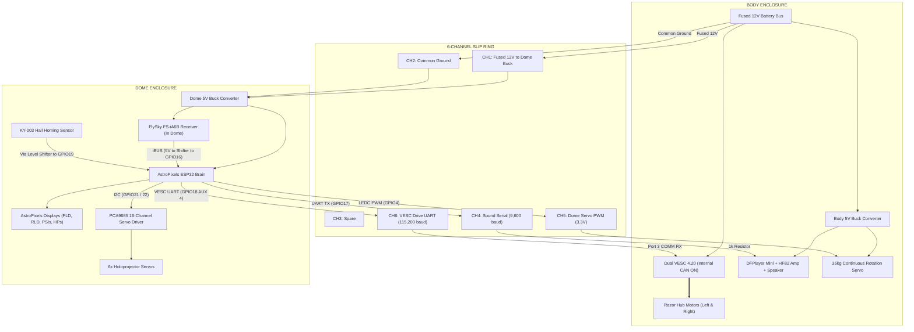

# AstroPixels Unified ESP32 Dome Brain Guide
## (FastLED Alternative Firmware Reference)

> [!NOTE]
> **Primary Firmware:** The recommended firmware for this project is [AstroPixels Plus Unified](ASTROPIXELS_PLUS_UNIFIED/README.md), which includes the mobile Wi-Fi dashboard, OTA updates, and ReelTwo lighting.
> This document describes the alternative standalone FastLED sketch ([`ASTROPIXELS_UNIFIED_BRAIN.ino`](ASTROPIXELS_UNIFIED_BRAIN.ino)), retained as an engineering reference.

---

## 1. System Architecture & Signal Flow

The dome ESP32 serves as the central brain for the entire droid, running all lights, 6 holoprojector servos, sound triggering, dome rotation, and foot motor drive. The dome-mounted FlySky receiver sends all radio channels over digital iBUS to the ESP32, which commands the Dual VESC controller over UART down the slip ring.

---

## 2. MicroSD Card Audio Directory & Sound Pools

Format the MicroSD card as **FAT32**. Place audio files in the root folder or an `/MP3/` folder using **3-digit numerical prefixes** (e.g., `001.mp3`, `102.mp3`):

### A. Ambient Chatter Sound Pools
When R2 is idling in a persistent mood, background chatter randomly plays tracks from that mood's assigned bank:

| Track Range | Mood Category | Description & Style |
| :---: | :--- | :--- |
| `001 – 020` | **Happy & Chatty** | Upbeat whistling, harmonic chirps, friendly beeps |
| `021 – 040` | **Sassy & Annoyed** | Grumbling razzes, sarcastic buzzes, scoffing beeps |
| `041 – 060` | **Sad & Mournful** | Low downward whines, melancholic chirps |
| `061 – 080` | **Alert & Alarm** | Fast warning pulses, emergency chirps, klaxons |

---

### B. Synchronized Macro Routines
Triggered by flipping **switch `SwC` DOWN** on the transmitter:

| Track # | Routine Name | Dial `VrA` Position | Synchronized Behavior |
| :---: | :--- | :---: | :--- |
| `102` | **Scream / Panic** | **Pos 4** | Red flashing strobe + staggered, low-amplitude holoprojector twitches (4.5s) |
| `106` | **Cantina Band** | **Pos 5** | Marching lights + synchronized holoprojector dance steps (30s) |
| `109` | **Princess Leia** | **Pos 6** | Auto-aligns dome forward to 0° + pale green logics + front HP dips down 35° with blue flicker (14s) |
| `110` | **Star Wars Disco** | **Pos 7** | Full rainbow wave across all displays (20s) |
| `107` | **Short Circuit / Faint**| **Pos 8** | Brief dim flicker, all displays go dark, servo PWM disabled for 5s, then re-centers |
| `011` | **Auto-Center Reset** | **Pos 1** | Rotates dome to lock onto the magnet (0° home), centers all servos, resets lights |
| `255` | **Startup Chime** | *Boot* | Plays automatically on power-up |

---

## 3. FlySky FS-i6X Transmitter Channel Assignments

| Channel | Physical Control | Function |
| :---: | :--- | :--- |
| **CH 1** | Right Stick Horizontal | **Steering:** Differential tank steering mixed by ESP32 |
| **CH 2** | Right Stick Vertical | **Throttle:** Forward and reverse throttle mixed by ESP32 |
| **CH 3** | Left Stick Vertical | **Manual Front Holo Tilt:** Overrides servo; holds position for 3s before resuming ambient moves |
| **CH 4** | Left Stick Horizontal | **Manual Dome Rotation:** Proportional continuous speed control; stops dead at center |
| **CH 5** | Switch `SwB` (3-Pos) | **Dual Rates (Speed):** Pos 1 = Slow (35%), Pos 2 = Medium (70%), Pos 3 = Fast (100%) |
| **CH 6** | Switch `SwA` (2-Pos) | *Unused* |
| **CH 7** | Knob `VrA` | **Mood & Macro Selector:** Selects active mood (Pos 1–13) |
| **CH 8** | Switch `SwC` (3-Pos) | **Macro Trigger:** Flip DOWN to trigger the routine selected by `VrA` |
| **CH 9** | Switch `SwD` (2-Pos) | **Holoprojector Motion Toggle:** High enables random autonomous twitches; Low pauses them |

---

## 4. Software Performance & Architecture

* **Zero Dynamic Heap Allocation:** Avoids `malloc()`, `free()`, and the `String` class during the main loop to prevent heap fragmentation.
* **PROGMEM Storage:** Sound lookup tables and macro definitions are stored in Flash memory.
* **Hardware Timers & Offloading:**
  * Dome Continuous Servo PWM: Generated by the ESP32 hardware **LEDC timer** (near-zero CPU overhead).
  * iBUS & Sound: Processed via **Hardware UART1 / UART2 FIFO** buffers.
  * 6 Holoprojector Servos: Offloaded to the external **PCA9685 I2C driver**.
