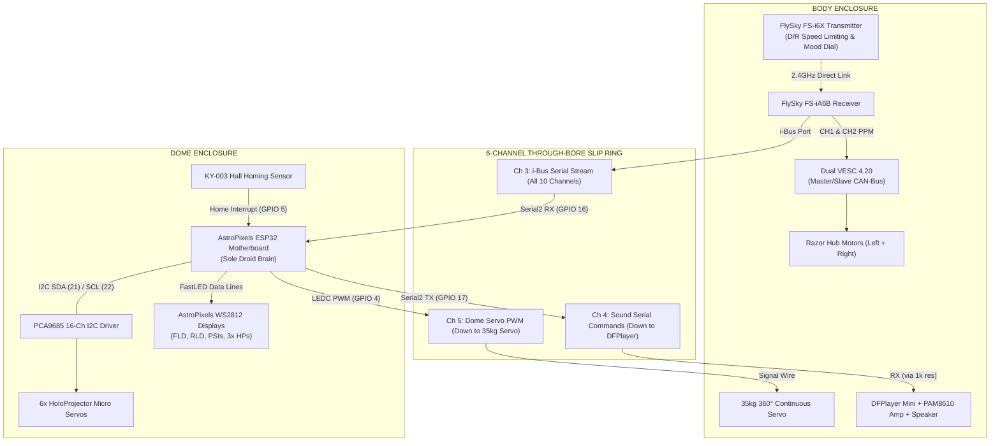

# AstroPixels Unified ESP32 Dome Brain Guide
## (Complete Setup, FastLED, PCA9685, i-Bus, and Sound Macros)

This guide documents the software configuration and operation of the **AstroPixels 30-Pin ESP32** running as the **Sole Master Brain** for the R2-D2 droid.

---

## 1. System Overview & Signal Flow

There is **NO Arduino Mega** in this droid. The ESP32 in the dome handles all lights, servos, sound triggers, and dome rotation, while the FlySky receiver in the body directly commands the Dual VESC 4.20 for foot drive:

---

## 2. Required Arduino IDE Libraries

To compile and upload **`ASTROPIXELS_UNIFIED_BRAIN.ino`** to the ESP32:

1. **`FastLED`** (by *Daniel Garcia*)
   * Controls all WS2812B addressable LED displays (FLD, RLD, PSIs, and HP LED boards).
2. **`Adafruit PWM Servo Driver Library`** (by *Adafruit*)
   * Controls the PCA9685 16-channel I2C servo controller on `GPIO 21` (SDA) and `GPIO 22` (SCL).
3. **`Wire`** *(Built-in)*
   * I2C communications.

---

## 3. FlySky FS-i6X Transmitter Channel Mapping

| Channel | Transmitter Control | What It Controls on R2 |
| :---: | :--- | :--- |
| **CH 1** | **Right Stick Horizontal** | **Steering (Left / Right)** $\rightarrow$ Direct to Master VESC |
| **CH 2** | **Right Stick Vertical** | **Throttle (Forward / Reverse)** $\rightarrow$ Direct to Master VESC |
| **CH 3** | **Left Stick Vertical** | **Autodome Twitch Frequency / Speed** |
| **CH 4** | **Left Stick Horizontal** | **Manual Dome Rotation** (Overrides Autodome) |
| **CH 5** | **Switch `SwB` (3-Position)** | **Transmitter Dual Rate Speed**: Pos 1 = Slow (35%), Pos 2 = Med (70%), Pos 3 = Fast (100%) |
| **CH 6** | **Switch `SwA` (2-Position)** | **Drive Safety Lockout** |
| **CH 7** | **Rotary Knob `VrA`** | **Personality / Mood & Macro Selector (1 to 13)** |
| **CH 8** | **Switch `SwC` (3-Position)** | **Macro Fire Trigger**: Flip DOWN to trigger selected routine |
| **CH 9** | **Switch `SwD`** | **HoloProjector Random Twitch Enable / Disable** |

---

## 4. Mood & Macro Routine Directory (`VrA` Knob)

When you dial **`VrA`** and flip **`SwC` DOWN**, the ESP32 executes the synchronized light, sound, and servo routine:

| `VrA` Position | Routine Name | Synchronized Light Action | Holo Servo Action | Sound Played |
| :---: | :--- | :--- | :--- | :--- |
| **1** | **Quiet Reset** | Normal R2 idle logic march | Center all 6 servos | `011_quiet.mp3` |
| **2** | **Full Awake** | Happy vibrant color cycle | Random twitch | `012_awake.mp3` |
| **3** | **Wave Sequence** | Fast sweeping logics | Wave holo pan/tilt | `003_wave.mp3` |
| **4** | **Scream / Alarm** | **Flashing Red Alert** (All LEDs red) | Rapid erratic twitches | `002_scream.mp3` |
| **5** | **Cantina Theme** | Rhythmic marching step lights | Synchronized beats | `006_cantina.mp3` |
| **6** | **Princess Leia** | **Pale Green Logics + Blue HP Flicker** | **Front HP aims down** | `009_leia.mp3` |
| **7** | **Star Wars Disco** | **Full Rainbow Party Cycle** | Dance sweep routines | `010_disco.mp3` |
| **8** | **Short Circuit** | Dim flicker and blackout | Servos go limp | `007_short_circuit.mp3` |
| **9–13** | **Random Chirps** | Normal idle animations | Ambient random wander | Tracks `001`–`005` |

---

## 5. Uploading Firmware to the ESP32

1. Connect the **AstroPixels ESP32 board** to your computer via USB-C/Micro-USB.
2. In Arduino IDE:
   * **Tools $\rightarrow$ Board $\rightarrow$ ESP32 Arduino $\rightarrow$ `ESP32 Dev Module`**
   * **Tools $\rightarrow$ Upload Speed $\rightarrow$ `921600`**
   * **Tools $\rightarrow$ Port $\rightarrow$ Select your ESP32 Serial Port**
3. Open **`ASTROPIXELS_UNIFIED_BRAIN.ino`** and click **Upload**.
4. Open **Serial Monitor** at **`115200 baud`** to view live transmitter and servo telemetry.
