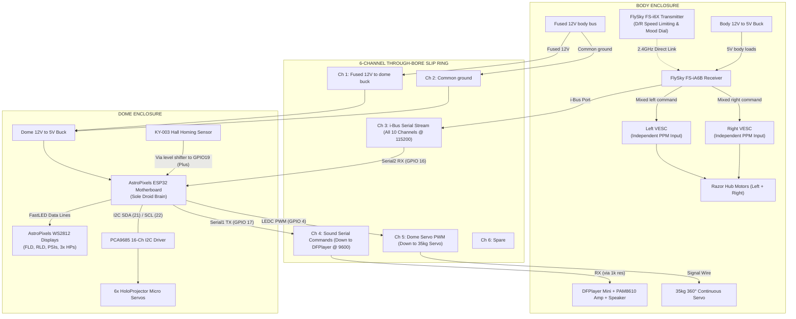

# AstroPixels Unified ESP32 Dome Brain Guide
## (Persistent Mood Engine, Sound Pools, FastLED & PCA9685)

**Preferred firmware:** [AstroPixels Plus Unified](ASTROPIXELS_PLUS_UNIFIED/README.md), which preserves Wi-Fi, OTA and ReelTwo lights. Its README is the firmware/control reference for this build. The macro and mood descriptions below describe the earlier `ASTROPIXELS_UNIFIED_BRAIN.ino` FastLED alternative, not an interchangeable sketch. Do not flash or compile both sketches together.

---

## 1. System Architecture & Signal Flow

The ESP32 in the dome handles all lights, 6 holo servos, sound triggering, and dome rotation, while the FlySky receiver in the body directly commands the Dual VESC 4.20 for foot drive:

---

## 2. MicroSD Card Directory & Sound Pool Matrix

Format your MicroSD card as **FAT32**. Place audio files in the root directory (or an `MP3` folder) using the following **3-digit numerical prefixes**:

### A. Categorized Ambient Mood Sound Pools
When R2 is idling in a persistent mood, background chatter automatically pulls randomly from that mood's assigned sound range:

| Track Range | Mood Category | Associated Mood | Sound Characteristics |
| :---: | :--- | :--- | :--- |
| `001 - 020` | **Happy & Chatty** | `MOOD_HAPPY` & `MOOD_NORMAL` | Upbeat whistling, harmonic chirps, friendly beeps |
| `021 - 040` | **Sassy & Annoyed** | `MOOD_SASSY` | Grumbling razzes, sarcastic buzzes, scoffing beeps |
| `041 - 060` | **Sad & Mournful** | `MOOD_SAD` | Low downward whines, melancholic chirps |
| `061 - 080` | **Alert & Alarm** | `MOOD_ALERT` | Fast warning pulses, emergency chirps, klaxons |

---

### B. One-Shot Interactive Macro Tracks
Triggered when you flip **`SwC` DOWN** on the transmitter:

| Track # | Macro Name | Dial Position (`VrA`) | Synchronized Droid Behavior |
| :---: | :--- | :---: | :--- |
| `102` | **Scream / Panic** | **Pos 4** | Red flashing strobe + staggered, low-amplitude holo-servo twitches ($4.5\text{s}$) |
| `106` | **Cantina Band** | **Pos 5** | Track 106 with marching lights and staggered, small holo-servo dance steps. The current duration is provisionally 30 seconds; set it to the actual audio-file length when known. |
| `109` | **Princess Leia** | **Pos 6** | **Auto-aligns head forward to audience ($0^\circ$)** + Pale green logics + Front HP aims down $35^\circ$ with blue flicker ($14\text{s}$) |
| `110` | **Star Wars Disco** | **Pos 7** | Full rainbow wave across all displays ($20\text{s}$) |
| `107` | **Short Circuit / Faint** | **Pos 8** | Brief dim flicker, then all displays black and holo-servo PWM disabled for 5 seconds; servos are re-centered afterward. |
| `011` | **Auto-Center Reset** | **Pos 1** | **Spins dome to lock onto magnet ($0^\circ$)**, centers all servos, and resets lights to normal |
| `255` | **Startup Chime** | *Boot* | Played on initial power-on |

---

## 3. FlySky FS-i6X Transmitter Channel Assignment

| Channel | Physical Control | Functional Role on Droid |
| :---: | :--- | :--- |
| **CH 1** | **Mixed receiver output** | **Left motor command** $\rightarrow$ Left VESC PPM input (verify output mapping and direction) |
| **CH 2** | **Mixed receiver output** | **Right motor command** $\rightarrow$ Right VESC PPM input (verify output mapping and direction) |
| **CH 3** | **Left Stick Vertical** | **Manual Front Holo Tilt (Up / Down)**: Overrides servo; holds position for 3s before resuming mood twitches |
| **CH 4** | **Left Stick Horizontal** | **Manual Dome Rotation Override**: Proportional continuous rotation; Zero-Creep sleep when centered |
| **CH 5** | **Switch `SwB` (3-Position)** | **Transmitter Dual Rates (Speed)**: Pos 1 = Slow (35%), Pos 2 = Med (70%), Pos 3 = Fast (100%) |
| **CH 6** | **Switch `SwA` (2-Position)** | **Unused: no drive lockout is implemented on the ESP32 or configured as a VESC input** |
| **CH 7** | **Rotary Knob `VrA`** | **Persistent Mood & Macro Selector (1 to 13)** |
| **CH 8** | **Switch `SwC` (3-Position)** | **Macro Fire Trigger**: Flip DOWN to execute selected routine |
| **CH 9** | **Switch `SwD`** | **HoloProjector Random Motion Toggle**: High enables autonomous holoprojector motion; low disables it. Manual front holo tilt remains available. |

Use the normal Mode 2 right stick for tank drive (vertical throttle, horizontal steering), with transmitter-side differential mixing. Verify the receiver's left/right outputs at neutral, forward, reverse, and steering before connecting or lowering the wheels. Configure receiver neutral failsafe on both mixed outputs and a separate VESC input timeout; test both with the wheels raised. The VESC slave-mode toggle remains OFF.

The body and dome have separate 12V-to-5V, 10A buck converters. Fused 12V and common ground pass through the slip ring to the dome converter; its 5V output powers dome electronics. Do not parallel the two 5V outputs. Follow [the level-shifter wiring table](DOME_WIRING_DIAGRAM.md#4-logic-level-wiring-required) for i-Bus, Hall, audio TX and dome PWM; GPIO19 is the Plus Hall input.

---

## 4. Flash & Memory Optimization Architecture

* **Zero Dynamic Heap Allocation**: No `malloc()`, `free()`, or `String` class usage in loop cycles, preventing heap fragmentation and ensuring $200\text{Hz}$ deterministic execution.
* **PROGMEM Sound Tables**: All sound ranges and macro configurations are stored in Flash memory.
* **Hardware Offloading**:
  * Dome Servo PWM: Generated by ESP32 **LEDC hardware timer** ($0\%$ CPU load).
  * i-Bus & Audio: Handled by **Hardware UART1/UART2 FIFO** buffers.
  * 6 Holo Servos: Offloaded to **PCA9685 I2C coprocessor**.
