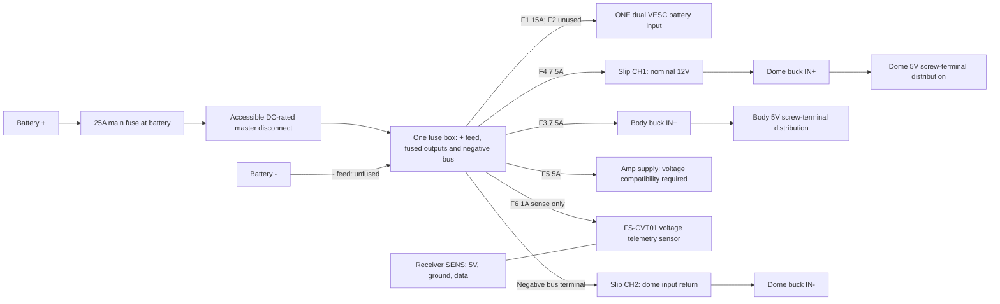

# R2-D2 Power Harness: Assembly, Shopping and Acceptance

This is the **approved construction specification**, not evidence that the hardware has been measured or commissioned. Open [wiring_visualizer.html](wiring_visualizer.html) directly in a browser for the interactive schematic and complete terminal schedule. It works offline, supports filtering/search/inspection and prints the selected wire schedule. Select **All circuits** and clear search before printing the whole harness.

The visualizer replaces the electrical assumptions in the supplied Downloads HTML; that original remains untouched. `index.html` is still the separate mechanical foot-drive visualizer.

## 1. Fixed design inputs

| Item | Agreed value |
| --- | --- |
| Battery | Renogy RBT1220LFP-TM, nominal 12V LiFePO4; plan around 20A continuous discharge |
| Body converter | Second fixed 5V/10A converter |
| Dome converter | Existing fixed 5V/10A converter |
| Converter product | [Amazon B09T954ZV1](https://www.amazon.ca/dp/B09T954ZV1): listing specifies 10-35V input, fixed 5V/10A output, 50W, non-isolated |
| Slip ring | Six contacts, user-confirmed 10A/contact and **17AWG factory leads** |
| Added battery/accessory power runs | **At most 1m one-way per run**; keep 5V high-current runs much shorter where possible |
| Motor phase and Hall extensions | **2m one-way per motor**, via foot -> leg -> shoulder -> body |
| Drive settings | Independent controllers; 5A battery-current max and 2.5A regen magnitude per side; motor phase-current ceiling still requires resolution |
| Grounds | Common body/dome negative and signal reference; no negative fuses |
| 5V positive rails | Body and dome outputs stay separate; no parallel outputs or spare ring power contact |

The converter is fixed-output: **measure it, do not adjust it to 5.05V**. The product listing has inconsistent generic prose about other output voltages; use the actual unit's label and the explicit 5V specification, then confirm with a meter. Marketing protection/lifetime claims are not commissioning evidence.

## 2. Power path and terminal connections

**The selected fuse box has both positive and negative feed terminals.** Battery positive reaches its + terminal through the main fuse and cutoff; battery negative connects directly to its - terminal. Each device's positive connects to an assigned fused output, and its return connects to an individual negative-bus terminal on the same box. "Negative bus" means this integrated section, not a separate purchase. The positive and negative buses are electrically separate; no internal + to - connection exists.

**Actual connector cavities are not drawn in mating-face order.** Read each module's markings and exact revision pinout; never wire a connector by its apparent position in this diagram. The user confirms **one shared battery input pair** on the dual VESC. Feed that existing connector from F1 only; F2 is unused with no fuse installed. Left/right VESC nodes represent independently controlled motor channels powered internally by the same board, not separately supplied devices. Never parallel two fused outputs to feed it.

| Connection | Added wire | Positive-side protection | Termination |
| --- | --- | --- | --- |
| Battery + -> main fuse IN | 10AWG red | Main fuse downstream; this short section is unfused | Battery-size crimp ring lug; covered fuse-holder terminal |
| Main fuse OUT -> cutoff IN -> fuse box + FEED | 10AWG red | 25A main | Correct stud-size crimp rings; terminal covers |
| Battery - -> fuse box - FEED | 10AWG black | None | Correct stud-size rings; covered input stud |
| F1 -> shared dual VESC positive lead; negative lead -> negative bus | 12AWG red/black | 15A starting selection | Actual unit has bare factory leads: rated gauge-matched crimp splices to extensions, then terminals matching fuse-box studs; verify polarity/gauge; no external split |
| F2 | No wire | No fuse installed | Unused spare circuit |
| F3 -> body buck IN+; IN- -> negative bus | 16AWG red/black | 7.5A | Rated crimp splice or genuine XT30 removable input pair |
| F4 -> ring body CH1 -> ring dome CH1 -> dome buck IN+ | 16AWG red extensions, existing 17AWG ring leads | 7.5A **before ring** | Gauge-matched sealed crimp splices; continuity-label each contact |
| Negative bus -> ring body CH2 -> ring dome CH2 -> dome buck IN- | 16AWG black extensions, existing 17AWG ring leads | None | Same splice/strain-relief method |
| F5 -> amplifier supply +; power GND -> negative bus | 18AWG red/black | 5A | Actual board terminal specification |
| F6 -> FS-CVT01 SENSE+; SENSE- -> negative bus | 22AWG red/black | 1A | Insulated crimp splice to verified sensing leads; NOT the sensor supply cable |
| Each buck OUT+ / OUT- -> its local 5V strip FEED / GND | 12AWG red/black extensions | Input fuse only; no 5V output fuses by user decision | Short leads; proper terminal wire-range compatibility |

Place the main fuse **as close to battery positive as practical, target <=150mm of cable**. Mechanically protect that unfused segment. The cutoff comes **after** this fuse and **before every operating-load branch**. Fit it where an operator can reach it immediately without opening the dome or reaching past moving wheels. A switch hidden deep inside the body is not an accessible cutoff.

### Local 5V branches

| Local strip output | Load | Added supply/return wire | Installed output fuse |
| --- | --- | --- | --- |
| Body SERVO | TD-8135MG-360 dome-drive servo | 16AWG extensions | None |
| Body DFPLAYER | DFPlayer VCC/GND | 20AWG | None |
| Body RECEIVER | FS-iA6B supply/GND | 22AWG | None |
| Dome PCA | PCA9685 **V+**/GND servo supply | 16AWG | None |
| Dome LIGHTS | AstroPixels labeled **5V screw terminal**/GND, including factory lights | 18AWG | None |
| Dome LOGIC | Shifter HV and KY-003 +5V, with separate ground returns | 22AWG to each | None |

**User-directed decision:** body and dome use screw-terminal strips with separate shared positive and negative buses, not fused distributions. No 5V output/device fuses are required by this build plan, installed or shown. Retain the 12V buck-input fuses. The user has elected to rely on the converter's advertised overload/over-current/short-circuit protection; this is a design decision, not verified downstream fault-protection performance.

**Residual limitation, not a 5V-fuse commissioning hold:** added thicker wire does not uprate a thinner device pigtail, connector or PCA9685 copper trace. A 7.5A fuse on the buck's12V input does not establish protection for each5V output lead. The listing does not specify fault-current thresholds, shutdown timing or auto-recovery behaviour. Consequently, protection of those paths during a fault remains unverified with the chosen unfused outputs. Normal-load voltage/temperature checks do not prove short-circuit protection. Still verify normal-load wire/header/PCB ratings, insulation and strain relief; stop for faults or heating. Do not deliberately short the converter as a test.

Verify normal peaks and inrush with free, non-binding mechanisms. If an installed12V fuse opens, disconnect and find the cause; **do not simply install a larger fuse**. Changing a fuse requires reconsidering every wire, pigtail, connector and PCB trace it protects.

## 3. Why these wire and fuse sizes

At 50W output and assumed 90% converter efficiency:

- At 12V input: `50 / (12 x 0.90) = 4.63A`.
- At 10V input: `50 / (10 x 0.90) = 5.56A`.

A 7.5A input branch is a reasonable initial selection for each converter and the 17AWG/10A-rated ring feed. This is **not** a precise electronic current limit: blade fuses can carry overloads for a time before opening. Use a recognized fuse/holder manufacturer, the actual fuse datasheet and installation-temperature derating. The ring's stated continuous rating does not establish a short-circuit withstand curve; verify actual current, voltage drop and temperature rather than claiming guaranteed contact protection.

The 25A main protects the selected 10AWG harness; it does **not** enforce the battery's 20A continuous rating. The shared15A VESC fuse protects its12AWG supply branch, not motor winding temperature or the5A-per-channel software setting. Verify factory connector/lead suitability, fuse curve and startup inrush. A nuisance opening requires investigation, not an automatic fuse increase.

For reference, approximate added-copper drop at 20C, excluding connections and factory leads:

| Run (1m positive + 1m negative) | Current | Approximate drop |
| --- | --- | --- |
| 10AWG main | 20A | 0.13V |
| 12AWG shared VESC supply | 10A | 0.10V |
| 16AWG converter input | 5.6A | 0.15V |
| 12AWG 5V trunk | 10A | 0.10V |
| 16AWG servo branch | 5A | 0.13V |
| 18AWG AstroPixels branch | 3A | 0.13V |

Drops accumulate along the complete route; warm wires and joints add resistance. These numbers are not insulation ampacity ratings. Purchase **stranded copper, not copper-clad aluminium**, with documented gauge/temperature/current ratings suitable for flexible low-voltage DC harnesses. Route away from heat and avoid tightly bundling power conductors in insulation.

Combined full converter output can consume roughly 9-10A from a nominal 12V battery; drive settings allow another 10A, plus amplifier load. **All loads at maximum simultaneously are not proven compatible with the 20A battery budget.** Measure combined battery current and reduce drive/accessory demand if necessary; do not raise the main fuse to solve a BMS trip.

## 4. Connections, disconnects and shopping schedule

### Hardware selection

| Purchase | Quantity / minimum specification |
| --- | --- |
| Main fuse holder | 1; DC voltage >=32V, continuous >=30A, 10AWG leads or studs rated for 10AWG terminations |
| Main fuse | 25A, matched to that holder; buy spares |
| Master disconnect | 1; documented DC **load-break** rating >=30A at >=16V, covered terminals, capacitor/inrush suitability; higher-rated battery switch acceptable |
| 12V fuse box with integrated negative bus | 1; + and - feed studs, six positive circuits (F2 unused), >=32V DC, >=30A total; F1 holder/circuit >=15A, others rated for their fuses; negative bus >=30A; covered |
| Local 5V screw-terminal distributions | 2; >=15A total; separate positive/ground buses; no branch fuses installed |
| Branch fuses, installed count | 15A x1; 7.5A x2; 5A x1; 1A x1, plus25A main. F2 empty. Match each holder family; add spares. No5V output fuses by user decision; charger-supplied10A fuse is separate |
| Converter | 1 additional B09T954ZV1-equivalent verified 10-35V -> fixed5V/10A unit |
| Main removable battery connection | Optional genuine XT90/XT90-S pair with insulated source-side contacts; preserve a suitable existing connector if present |
| VESC supply terminations | Bare factory input leads confirmed; gauge-matched insulated crimp splices and fuse-box stud-size rings. Optional removable connector only if deliberately added and rated; no existing factory connector assumed |
| Converter input disconnects | Optional genuine XT30 pairs x2; label **12V INPUT** |
| Converter output disconnects | Optional different keyed family from input, e.g. genuine XT60 pairs x2, labeled **BODY 5V** / **DOME 5V**; never use identical unkeyed input/output pairs |
| Splices/terminals | Tinned-copper ring lugs matching **actual measured studs**; insulated crimp butt splices with compatible wire ranges (including 16/17AWG join); ferrules where terminal manufacturer permits them |
| Routing/insulation | Adhesive heatshrink, terminal boots, abrasion sleeve, grommets, screw-mounted cable clamps, permanent wire labels |
| Measurement tools | DC voltmeter/multimeter, DC-capable clamp meter or appropriately rated inline wattmeter, continuity test leads |

Do not assume the battery terminal thread or wire-entry range of a generic terminal block. Select those dimensions from the actual hardware. Do not force 12AWG into an undersized converter/output terminal or replace it with a thinner unprotected stub.

Expose only the safe/recessed contact side on a live battery source. Connector family names alone do not guarantee contact quality/current rating: purchase genuine rated parts and compatible mates. An anti-spark connector can reduce connection arcing; it does not replace the fuse or DC-rated cutoff.

### Wire purchase allowances

Measure final routes before cutting. These are conservative shopping allowances for the agreed lengths, **not new permitted run lengths**:

| Wire | Allowance |
| --- | --- |
| 10AWG | 4m red + 2m black for main positive path and negative return |
| 12AWG shared VESC supply | 1.5m red + 1.5m black allowance; each installed extension <=1m one-way |
| 16AWG | 6m red + 6m black for converter feeds, ring extensions and servo trunks |
| 12AWG power trunks | 3m red + 3m black for two local buck output pairs |
| 12AWG motor phases | **At least 12m total**, six 2m conductors; buy ~15m for routing/termination allowance |
| 18AWG | 3m red + 3m black for amp/lights/capacitor |
| 20AWG | 2m red + 2m black plus suitable paired speaker cable |
| 22AWG | Assorted low-current supply/signal colors, plus **two >=2m five-core flexible Hall cable runs**; buy ~5m five-core cable |

Six phase conductors x2m is 12m, not 4m. The VESC's [listed factory motor/power leads are 12AWG](https://flipsky.net/products/flipsky-mini-dual-fsesc4-20-100a-based-on-vesc-with-anodized-aluminum-heatsink); extending phases with 12AWG preserves that gauge but adds resistance/inductance. Resolve the motor's phase-current commissioning limit before running detection. A 5A battery limit cannot justify an arbitrary phase current.

## 5. Signal wiring and ground rules

The complete HTML schedule includes each phase/Hall lead, translated signal and servo channel. The core allocation remains:

| Ring contact | Function |
| --- | --- |
| CH1 | F4-protected nominal battery + to dome converter IN+ |
| CH2 | Common ground / dome converter input return |
| CH3 | Receiver iBUS -> HV1 input -> LV1 **3.3V output** -> GPIO16 |
| CH4 | GPIO17 direct 3.3V output -> DFPlayer RX via 1kohm at RX; no shifter |
| CH5 | GPIO4 direct 3.3V output -> body dome-servo signal; no shifter |
| CH6 | Spare, separately insulated at both ends |

Shifter HV uses dome regulated5V; LV uses a **verified ESP32 3.3V pin**. AstroPixels AUX V pins are **5V**. PCA9685 VCC uses3.3V, V+ uses5V, and I2C pull-ups terminate at3.3V. Do not blindly connect the AstroPixels I2C header's positive pin to PCA VCC. Confirm this against the actual board.

**AstroPixels motherboard to PCA9685:** I2C header **G -> PCA logic-header GND**, **C (GPIO22) -> SCL**, **D (GPIO21) -> SDA**. Leave I2C **V unconnected**. Separate motherboard **3V3 supply -> PCA VCC**, after measuring3.3V againstGND. Dome5V distribution powers the PCA green screw-terminal **V+**, notVCC. With PCA disconnected/unpowered, confirm the green terminal's unlabeled position has near-zero resistance to a markedGND pin before connecting domeground there; confirmV+ continuity to the servo power row. Physical pin order is not implied by this list. Leave address jumpers at default0x40; check servo signal/power/ground orientation for channels0-5.

Only **two downshift channels** are used: iBUS enters HV1 and leaves LV1 for GPIO16; dome Hall enters HV2 and leaves LV2 for GPIO19. Confirm the owned shifter's pinout and5V-to-3.3V capability at the iBUS baud rate. Extra channels remain unused. No HV signal terminal connects to an ESP32 GPIO.

The actual board labels are **LV1, LV2, LV, GND, LV3, LV4** on one side and **HV1, HV2, HV, GND, HV3, HV4** on the other. LV/HV are voltage references, not signal channels or a voltage regulator. The paired signal pins are bidirectional; "input/output" below describes their use in this build, not a fixed board direction.

| Function | Connections |
| --- | --- |
| Low-voltage reference | AstroPixels verified 3V3 -> LV |
| High-voltage reference | Dome regulated 5V -> HV |
| Ground reference | Common dome ground -> one GND pin, after unpowered continuity confirms both board GND pins are connected |
| iBUS signal path, channel 1 | Slip-ring CH3 -> HV1; LV1 -> ESP32 GPIO16 |
| Home-Hall signal path, channel 2 | Dome home-sensor output -> HV2; LV2 -> ESP32 GPIO19 |
| Unused channels | Leave HV3/LV3 and HV4/LV4 unconnected |

This is seven external wires: three reference wires and four signal wires forming two translated paths. Dome-servo PWM and DFPlayer audio UART do not pass through this board. If the two GND pins do not have continuity, stop and identify the board circuit before wiring.

**Battery telemetry:** the selected [FS-CVT01 (Amazon B0DQXT337L)](https://www.amazon.ca/dp/B0DQXT337L) replaces the standalone voltmeter. Its sensing pair connects to F6 and the fuse-box negative bus. Its separate factory3-wire power/data cable connects to the receiver's **SENS telemetry port**, not the servo-iBUS output used by the dome. Receiver5V powers the sensor; battery voltage goes only to its sensing input. [FlySky specifies](https://www.flysky-cn.com/cvt01-canshu)4.0-8.4V operating power and a separate +/-100V measurement range. Confirm actual pin labels/cable direction before wiring. F6 measures the switched bus, including upstream cable/switch drop, not an always-live battery-stud tap.

On the FS-i6X, select the external-voltage sensor readout and configure its low-voltage alarm using the actual transmitter manual; receiver supply voltage will read roughly5V and is not the battery reading. Verify external telemetry against a multimeter at the sense connection under load. This reports **voltage, not measured battery charge percentage**; LiFePO4's flat voltage curve makes a midrange percentage estimate unreliable. Use conservative voltage alarms and measured runtime; do not rely on BMS cutoff as the normal stop signal.

Dome PWM and audio commands originate at the ESP32 and bypass the shifter at3.3V. The selected dome servo accepts3.3V control signals per the user-confirmed specification; DFPlayer RX accepts3.3V UART. Both devices still use body5V power and common ground. Check the actual units and confirm reliable operation while rotating the ring. DFPlayer TX is unused.

Receiver-to-VESC leads carry **signal and ground only**. Remove/insulate the +5V conductor at each VESC PPM connection to avoid paralleling the VESC BEC(s) with the body buck. This does not remove the VESC Hall supply: each foot motor's Hall red/black receives its controller's verified Hall5V/GND. Yellow/blue/green to H1/H2/H3 is a starting assignment for detection, not a factory color guarantee. Motor TEMP pins remain unconnected and insulated.

Foot-motor Hall cables use all five conductors together, with their ground in the same bundle; keep separate from phase wiring as practical. No Hall-level shifter is added between motor and VESC. The dome sensor is a different Hall device and **does** use the dome shifter.

Actual VESC Hall adapter order is user-reported **top to bottom in their observed orientation: GND, H3, H2, H1, TMP,5V**. Initial motor mapping: black, green, blue, yellow, unused, red respectively. This is not a manufacturer pin numbering or a mating-face drawing; mark the orientation and5V/GND ends before assembly. See the drive guide's Hall table. TMP stays unused; supply polarity must be correct before detection.

For audio, use DFPlayer **DAC** output, not its amplified SPK pins, into the amp's line input. A signal ground-loop isolator is not a B0505S power converter. Speaker connects across the chosen amplifier channel's + and - terminals; **neither speaker terminal connects to common ground**. Verify amplifier supply range against the actual fully charged battery/charger maximum before using the raw battery branch.

The selected replacement is [HF82 / TPA3110, Amazon B09F2XR9MN](https://www.amazon.ca/dp/B09F2XR9MN), listed for8-26V DC and4-10ohm speakers. It replaces the PAM8610 with contradictory voltage specifications; the listed range covers the battery's approximately14.6V full-charge voltage without another regulator. Connections are solder pads, not screw terminals or a barrel socket. Confirm actual pad labels, use properly rated flexible pigtails where pad size requires them, insulate joints and independently anchor wires to avoid pulling pads. F5 remains the5A positive input branch.

Volume is commanded by the ESP32 through DFPlayer UART. The Plus factory default is **10/30**; an existing saved Wi-Fi volume preference takes precedence. Use the Wi-Fi Sound Volume slider and save to change it. No remote-knob volume mapping is implemented. Start low; volume is not a calibrated speaker-power limiter.

### Audio assembly: selected 3.5mm isolator and adapters

Use the user-selected [BESIGN ground-loop isolator, Amazon B06XQYN77L](https://www.amazon.ca/dp/B06XQYN77L) in the analog line-level path, with **3.5mm stereo TRS-to-screw-terminal adapters** at the source and amplifier ends. It needs no external power. Use adapters/cables with the correct male/female mating arrangement for the supplied isolator.

The current build uses one speaker and the left amplifier channel:

| Connection | Terminal mapping |
| --- | --- |
| DFPlayer -> source adapter | DAC_L -> tip / L; DFPlayer GND -> sleeve / GND |
| Source adapter -> isolator -> amplifier adapter | Matching stereo TRS cable/connectors; retain input/output orientation if marked |
| Amplifier adapter -> amplifier line input | Tip / L -> amplifier LINE L; sleeve / GND -> amplifier LINE GND |
| Amplifier -> speaker | Amplifier L+ -> speaker +; amplifier L- -> speaker - |

Ring / R is unused on both adapters; DFPlayer DAC_R and amplifier right-channel outputs remain unconnected. **Do not short DAC_L and DAC_R together** to make mono. DFPlayer SPK1/SPK2 are unused: never connect them to this isolator or amplifier line input.

Confirm tip/ring/sleeve mappings on each unplugged adapter with continuity; do not assume screw-terminal order or trust an ambiguous label. Do not add an external wire between the source-side and amplifier-side sleeves: that bypasses the isolator. Amplifier line ground may already connect internally to amplifier power ground; its normal power return stays connected. Neither speaker terminal connects to either sleeve or common ground. Begin at low volume and confirm clean audio before increasing it.

## 6. Assembly and strain relief

1. Disconnect battery and charger. Mount components, fuse blocks, cutoff and covered buses before making the harness. Do not use the shell as electrical ground. Leave fuses removed.
2. Dry-route wire pairs and label both ends by the HTML wire IDs. Keep high-current positive/return pairs together. Reserve a service loop at each shoulder for the full mechanical movement without tension or rubbing.
3. Protect every shell/metal hole with a grommet and sleeve. Support wires on both sides of joints/connectors with anchored clamps; adhesive clips alone can release. Keep connectors away from the axle cable exit and shoulder flex point.
4. Cut, strip and crimp with a tool matched to the terminal. Inspect strands and give each crimp a firm tug test. No exposed copper. For screw clamps, use permitted ferrules/bare strands per terminal instructions, **not solder-tinned wire ends** that can creep under pressure.
5. Solder only where the actual connector requires it, with heatshrink and independent strain relief. A soldered joint is not a flexible hinge. Do not solder/splice the existing ring contacts themselves; extend accessible pigtails.
6. With all loads detached, continuity-identify and label ring contacts through several rotations. Verify CH6 insulated, positive/negative buses not bridged, switch action correct, and no accidental contact with frame/hardware.
7. Connect negative return, then the covered battery positive lead with main fuse still removed and cutoff OFF. Make all later changes with battery/charger disconnected. Even with cutoff OFF, the battery-to-switch wiring and any attached charge lead can be live.

If a multipole dome connector is added for service, its power pins must support the fuse/current and its mating procedure must preserve the ground reference. **Only disconnect/reconnect with battery and charger disconnected**; no hot-plugging signal wires while power ground is absent.

## 7. Acceptance: do not connect everything at once

Record measurements and pass/fail for each stage. The voltage targets below are project acceptance targets, not substituted manufacturer limits; comply with any tighter actual-device specification.

| Stage | Action / pass condition |
| --- | --- |
| Unpowered harness | Fuses removed, loads disconnected. Check wiring against schedule, polarity, crimps, covers and strain relief. No unintended +/ground shorts; capacitors/electronics can produce changing resistance, so do not assume every continuity beep proves a short |
| Bare battery bus | Insert25A main, loads/branches still disconnected, cutoffOFF. Confirm main feed and cutoff input match measured battery voltage. CutoffON energizes fuse-blockFEED; cutoffOFF removes its battery feed |
| Bare converters | Install only F3/F4. Leave converter outputs unloaded. Confirm battery voltage at IN terminals, **positive5V at OUT terminals**, correct return paths. Accept **4.9-5.1V unloaded** or tighter module/device requirement; stop for wrong voltage/polarity |
| Converter load check | Use a suitably rated electronic DC load, or incrementally connected known loads. At actual planned demand, aim for **>=4.8V and <=5.1V at device terminals**, no reset/glitch or rising connection temperature. Measure both at buck output and device to separate regulation from cable drop |
| Converter capacity, if testing full10A | A commercial DC load rated for at least50W with cooling; or a suitably engineered load fixture. At5V/10A,50W becomes heat. Do not improvise loose resistor loads inside the shell or deliberately stall servos as a load test |
| Body electronics | Under the recorded unfused5V decision: receiver first; add FS-CVT01 SENS cable and F6 sense pair, verify external battery reading on remote against meter (not5V receiver voltage). Then DFPlayer and mechanically unloaded dome-drive servo, connected individually. Confirm PPM red wires removed; validate receiver failsafe without turning wheels |
| Dome electronics | AstroPixels first; then shifter/Hall; then PCA and one unloaded servo before all six. Center horns before attachment. Confirm3.3V at LV/VCC and no5V pull-ups on SDA/SCL |
| Dome through ring | Measure dome converter IN voltage and local5V under realistic motion/lights/audio. Rotate through the full dome travel; no dropout or intermittent signals. Check contacts, pigtails and splices for warming |
| Foot drive | Follow [VESC commissioning steps](VESC_DRIVE_INTEGRATION.md#4-vesc-tool-configuration-step-by-step): fused battery-powered identification first with motors/PPM disconnected; after installation and detection-current/phase-current approval, raise wheels, secure axle mounts and detect each independently. Check directions, neutral, transmitter-loss failsafe and separate missing-input timeout before progressive loaded/thermal testing |
| Combined operation | Measure total battery current while driving slowly with realistic lights, servo movement and audio. **Stay within20A continuous**, with operating margin. Converter10A labels and fuse sums do not establish available battery capacity |
| Cutoff and stopping | Confirm accessible cutoff removes operating-load feed. Controller capacitors may retain voltage briefly; wheels/dome can coast. This is electrical isolation, not a mechanical parking brake. Test receiver/VESC/dome stops separately |
| Warm-up | Run representative loads for at least15minutes, continue until temperatures stabilize; inspect with power safely isolated as needed. No hot joints, softening insulation, fault/reset or nuisance fuse opening; stop and investigate any progressive heating |

**Meter warning:** never put a meter in current mode across battery +/-. That is a short circuit. Prefer a **DC-capable** clamp around one conductor (both together cancels the reading) or a rated inline wattmeter installed with power disconnected. A typical multimeter10A input is not suitable for the whole20A system.

Do not energize amp or other nominal12V accessories until their actual maximum supply ratings accommodate the fully charged battery. Both specified bucks accept10-35V; this does not certify every other board. Configure low-voltage operation so the converters do not fall below their10V input minimum; do not depend on a BMS hard cutoff as normal operation.

## 8. Charging and service

The purchased charger is [ECO-WORTHY B09SYNQNC1](https://www.amazon.ca/dp/B09SYNQNC1), marketed as10A; the user-provided listing specifies **14.4V,9A in LiFePO4 mode**. This matches the battery's14.4-14.6V charging range and is below its10A recommended charge current. Confirm actual label/manual on arrival. Allow roughly2-3hours from nearly empty;20Ah/9A is only an idealized estimate, not a guaranteed charging duration.

Use its supplied **SAE ring-terminal lead with10A fuse**, strain-relieved at the battery, and verify connector polarity before mating. Follow battery/charger instructions and select **LiFePO4 mode**; do not use lead-acid repair/desulfation modes or charge below0C. Do not add a permanent unfused battery-positive lead for an improvised charge socket. BMS activation is **not a routine charging step**. If the supplied fuse opens, investigate rather than increase it.

Charge with masterOFF, wheels immobilized and the droid unattended-operation features off; follow the manufacturer's supervision/location guidance. Unplug charger before driving. MasterOFF does not isolate the charge lead, nor make battery studs safe to work on.

For the initial USB flash, follow the [ordered firmware walkthrough and staged acceptance](ASTROPIXELS_PLUS_UNIFIED/README.md#first-usb-flash-ordered-walkthrough): remove the ESP32 from the motherboard with all power disconnected, then use USB as its only supply with no external leads. Reinstall only with battery/charger/USB disconnected. Do not connect USB while the motherboard is externally powered unless its exact power-isolation/backfeed behaviour has been established. Do not supply servos or the lighting array from a computer USB port.

## 9. Remaining physical verification, not missing design choices

The approved new-wire gauges, proposed fuse sizes, signal allocation, cutoff topology and connector selection rules are now specified. These **actual-hardware gates remain**:

- Converter and servo factory pigtail normal-load ratings; aggregate PCA board/terminal rating. Unverified5V fault protection is a recorded residual limitation, not a requirement to add output fuses.
- Shared dual VESC bare-lead polarity/gauge/termination rating (one input pair confirmed); phase-current ceiling and motor temperature behavior.
- Actual shifter model and clean115200-baud operation through rotation.
- Amplifier maximum supply rating and actual battery/charger maximum voltage.
- Fuse inrush/temperature/time-current behavior and combined measured battery demand.

Do not label these gates complete from a drawing or firmware build. A documented commissioning hold is safer than a fabricated hardware rating.
