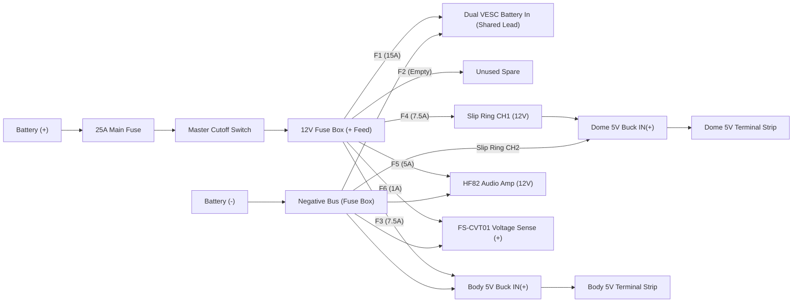

# R2-D2 Power Harness: Assembly, Shopping, and Testing Guide

This guide covers the wiring layout, fuse schedule, wire sizes, and step-by-step testing for the Home Depot R2-D2 conversion.

For an interactive, searchable schematic of every terminal and wire, open [wiring_visualizer.html](wiring_visualizer.html) in your web browser.

---

## 1. Core Electrical Specifications

| Parameter | Selected Hardware / Value | Notes |
| :--- | :--- | :--- |
| **Main Battery** | Renogy RBT1220LFP-TM (12V nominal / 12.8V, 20Ah LiFePO4) | Rated for 20A continuous discharge. |
| **Main Fuse** | 25A blade fuse in a heavy-duty waterproof holder | Placed on 10AWG wire within 150mm of the battery positive post. |
| **Master Disconnect** | High-current DC cutoff switch (rated &ge;30A @ &ge;16V DC) | Mounted where you can switch it off instantly from outside the droid. |
| **12V Fuse Box** | 6-way automotive blade fuse block with integrated negative bus | Powers all 12V branch circuits and provides a single common ground bus. |
| **5V Converters** | Two fixed 12V-to-5V, 10A buck converters ([Amazon B09T954ZV1](https://www.amazon.ca/dp/B09T954ZV1)) | One in the body, one in the dome. **Never connect their +5V outputs together.** |
| **Slip Ring** | 6-channel through-bore slip ring (10A per contact, 17AWG factory leads) | Mounts over the central dome pivot post. |
| **Foot Motor Extensions** | 12AWG stranded copper for phases, 22AWG 5-core for Halls | Approximately 2m each, routed from foot &rarr; leg &rarr; shoulder &rarr; body. |
| **Drive Power** | Single 12AWG feed to Dual VESC on fuse F1 (15A) | Software limit: 5A battery max per motor (10A combined). |

> [!IMPORTANT]
> The buck converters have fixed 5V outputs. Confirm their output voltage with a multimeter (expect 4.9V–5.1V) before connecting any logic boards or servos.

---

## 2. Power Architecture & Fuse Schedule



### 12V Fuse Box Schedule

The 12V fuse box provides six fused positive outputs and a common negative bus. Battery negative connects directly to the negative feed stud.

| Circuit | Destination | Wire Gauge | Fuse Size | Notes |
| :---: | :--- | :---: | :---: | :--- |
| **Main Feed** | Battery (+) &rarr; Main Fuse &rarr; Cutoff &rarr; Fuse Box (+) | 10AWG red | **25A** | Keep unfused wire from battery to main fuse under 150mm. |
| **Main Return** | Battery (&minus;) &rarr; Fuse Box Negative Bus | 10AWG black | *None* | Direct ground return; never fuse ground wires. |
| **F1** | Dual VESC power leads (shared input) | 12AWG red/black | **15A** | Both VESC channels share one factory power lead pair. |
| **F2** | Unused spare slot | &mdash; | *Empty* | Leave empty. Do not parallel with F1. |
| **F3** | Body 5V buck converter (12V in) | 16AWG red/black | **7.5A** | Input to body buck; negative returns to fuse box bus. |
| **F4** | Dome 5V buck converter (via slip ring CH1) | 16AWG red/black | **7.5A** | Fuse protects slip ring CH1 and dome buck input. |
| **F5** | HF82 audio amplifier (12V power) | 18AWG red/black | **5A** | Amplifier accepts 8–26V DC directly from the battery bus. |
| **F6** | FS-CVT01 battery telemetry sensor (sense leads) | 22AWG red/black | **1A** | Measures switched battery voltage; return to negative bus. |

---

### Local 5V Distribution (Body & Dome)

Each buck converter feeds a local screw-terminal block that splits 5V and ground among nearby components:

| Distribution Block | Connected Devices | Wire Gauge |
| :--- | :--- | :---: |
| **Body 5V Strip** | TD-8135MG-360 continuous dome rotation servo | 16AWG red/black |
| | DFPlayer Mini MP3 player (VCC / GND) | 20AWG red/black |
| **Dome 5V Strip** | PCA9685 servo driver green terminal (**V+** servo power / GND) | 16AWG red/black |
| | AstroPixels motherboard (**5V screw terminal** / GND) | 18AWG red/black |
| | FlySky FS-iA6B receiver (VCC / GND) | 22AWG red/black |
| | 3.3V/5V level shifter (**HV** reference) & KY-003 Hall sensor | 22AWG red/black |

> [!WARNING]
> The body and dome 5V rails must remain completely separate. Never run a wire between their +5V terminals. Common ground connects everywhere.

---

## 3. Wire Sizing & Current Demands

We chose wire gauges based on current draw and run lengths to keep voltage drops below 0.15V:

| Circuit | Typical Current | Wire Size | Approx. Drop (per 1m pair) |
| :--- | :---: | :---: | :---: |
| **Battery Main Feed** | Up to 20A | 10AWG | ~0.13V |
| **Dual VESC Supply** | Up to 10A (battery-side) | 12AWG | ~0.10V |
| **Motor Phase Leads (2m)** | Commissioning limit TBD | 12AWG | ~0.20V (2m run) |
| **5V Buck Converter Inputs** | ~4.5A–5.5A @ 12V | 16AWG | ~0.15V |
| **5V Buck Outputs (Trunk)** | Up to 10A @ 5V | 12AWG | ~0.10V |
| **Servo Power Trunks** | Up to 5A peak | 16AWG | ~0.13V |
| **Logic & Sensor Lines** | < 0.5A | 22AWG | Negligible |

* Always use **stranded copper wire** (not copper-clad aluminum / CCA). Flexible silicone-jacketed wire is ideal for tight spaces and moving joints.
* Total continuous current across the whole droid must stay within the battery's 20A limit. The Dual VESC is configured for 5A battery max per side (10A total), leaving ample headroom for dome servos, lights, and audio.

---

## 4. Shopping List & Wire Allowances

### Hardware & Fuses
* **1x Heavy-duty inline fuse holder:** Rated &ge;32V DC, &ge;30A, with 10AWG leads.
* **1x 25A ATO/ATC blade fuse:** Plus 2–3 spares.
* **1x High-current battery disconnect switch:** Rated &ge;30A DC at &ge;16V.
* **1x 6-way automotive fuse box:** With integrated negative bus and cover.
* **Assorted blade fuses:** 1x 15A, 2x 7.5A, 1x 5A, 1x 1A (plus spares of each).
* **2x Screw-terminal distribution blocks:** Rated &ge;15A, for local 5V distribution.
* **1x Second 12V-to-5V, 10A buck converter:** To match the existing unit ([Amazon B09T954ZV1](https://www.amazon.ca/dp/B09T954ZV1)).
* **Terminals & Heatshrink:** Tinned copper ring terminals (matching battery and fuse-box studs), butt splices, wire ferrules, and adhesive-lined heatshrink.

### Wire Lengths to Order
Measure your actual wire runs before cutting. These allowances include enough slack for service loops and routing:

| Wire Gauge | Recommended Order Length | Purpose |
| :--- | :--- | :--- |
| **10AWG** | 4m red, 2m black | Battery to main fuse, switch, and fuse box feed/return |
| **12AWG** | 15m (assorted colors or 5m red/black/blue) | 6x 2m motor phase extensions + VESC battery feed + 5V trunk pairs |
| **16AWG** | 6m red, 6m black | Buck converter 12V inputs, slip ring power runs, dome servo power |
| **18AWG** | 3m red, 3m black | Amplifier 12V power, AstroPixels lighting power feed |
| **20AWG** | 2m red, 2m black | DFPlayer 5V power, speaker wiring |
| **22AWG** | 5m 5-core flexible cable | Motor Hall sensor extensions (two 2m runs) |
| **22AWG** | Assorted single conductors | Receiver power, logic signals, level shifter, telemetry sense |

---

## 5. Signal Wiring & Logic Levels

```
                     ┌───────────────────┐
  Receiver iBUS ───> │ HV1           LV1 │ ───> ESP32 GPIO16 (iBUS RX)
  Dome Hall Sensor ─> │ HV2           LV2 │ ───> ESP32 GPIO19 (Homing)
  Dome 5V Rail ────> │ HV             LV │ <─── ESP32 3.3V Pin
  Common Ground ───> │ GND           GND │ <─── Common Ground
                     └───────────────────┘
```

### Level Shifter Connections (In Dome)
The ESP32 runs at 3.3V logic and is **not 5V tolerant**. Use a bidirectional logic-level shifter for 5V signals entering the ESP32:

* **Power references:** Connect **HV** to the dome regulated 5V rail. Connect **LV** to a verified 3.3V pin on the ESP32. Connect both ground pins to common ground.
* **Channel 1 (iBUS input):** Receiver iBUS pin (5V) &rarr; **HV1**; **LV1** &rarr; ESP32 **GPIO16** (RX2).
* **Channel 2 (Hall homing):** KY-003 Hall sensor signal (5V) &rarr; **HV2**; **LV2** &rarr; ESP32 **GPIO19** (AUX5).
* **Channels 3 & 4:** Leave unused.

### Signals Bypassing the Shifter
* **VESC Drive UART:** ESP32 GPIO18 (AUX 4) outputs 3.3V serial directly through slip ring CH6 into Dual VESC Port 3 Pin 6 (`RX`). The VESC STM32 MCU inputs 3.3V logic natively.
* **Dome Servo PWM:** ESP32 GPIO4 outputs a 3.3V PWM signal directly through slip ring CH5 to the servo signal wire in the body. The TD-8135MG-360 servo reliably accepts 3.3V control pulses.
* **Audio Commands:** ESP32 GPIO17 outputs 3.3V UART directly through slip ring CH4 and a 1k&Omega; series resistor into the DFPlayer RX pin.

### PCA9685 Servo Driver (In Dome)
* Connect the logic header: **G** &rarr; ESP32 I2C ground, **C** (SCL) &rarr; ESP32 **GPIO22**, **D** (SDA) &rarr; ESP32 **GPIO21**. Leave the motherboard I2C **V** pin disconnected.
* Connect PCA9685 **VCC** directly to the ESP32 **3.3V** pin.
* Connect PCA9685 green screw-terminal **V+** to the dome 5V distribution block for servo power.

### Dual VESC 4.20 COMM & Hall Sensors (In Body)
* **Port 3 (`COMM`) Wiring:**
  * **Pin 6 (`RX`):** Connect to **Slip Ring CH6** (from ESP32 GPIO18 AUX 4).
  * **Pin 3 (`-` / GND):** Connect to the fuse box negative bus for common signal ground.
  * **Pins 1 (5V), 2 (3.3V), 4 (ADC), 5 (TX), 7 (ADC2):** **LEAVE DISCONNECTED.** Never backfeed power from the VESC to the slip ring or ESP32.
* **CAN Switch:** Set the onboard toggle switch to **`ON: dual`**.
* **Motor Hall Sensors:** Each motor's 5-wire Hall cable plugs into Port 2 (`SENSE`) on its respective controller channel. The VESC provides 5V and ground to the Hall sensors. Wire initial signal leads as H1 = Yellow, H2 = Blue, H3 = Green. Leave the temperature pin (TMP) disconnected and insulated.

### Audio System & Ground Loop Isolator
```
  DFPlayer Mini                   BESIGN Isolator                HF82 Amp               Speaker
  ┌───────────┐                 ┌─────────────────┐           ┌───────────┐          ┌──────────┐
  │ DAC_L     │ ──[ Tip / L ]──>│ 3.5mm TRS In/Out│──[ Tip ]─>│ LINE IN L │──[ L+ ]─>│ (+)      │
  │ GND       │ ──[ Sleeve ]───>│                 │──[Sleeve]>│ LINE GND  │──[ L- ]─>│ (-)      │
  └───────────┘                 └─────────────────┘           └───────────┘          └──────────┘
```

* **Signal Path:** DFPlayer **DAC_L** &rarr; 3.5mm TRS adapter (Tip) &rarr; BESIGN ground-loop isolator &rarr; 3.5mm TRS adapter &rarr; HF82 amplifier left line input.
* **Ground Isolation:** Connect DFPlayer ground to the input adapter sleeve. Connect the output adapter sleeve to the amp line ground. Do not run an external ground jumper across the isolator.
* **Speaker:** Wire the 2.5" speaker across the amplifier's L+ and L&minus; terminals. **Neither speaker terminal connects to chassis or power ground.**
* **Volume:** Default volume is set in firmware to 10/30. Adjust it via the Wi-Fi dashboard.

### Battery Voltage Telemetry (FlySky FS-CVT01)
* Connect the sensor's red/black sense leads to fuse **F6 (1A)** and the fuse-box negative bus.
* Plug the 3-wire data cable into the **SENS** port on the FlySky receiver (not the iBUS servo port).
* On the transmitter, display external voltage (ExtV) and set a low-voltage alarm at **12.0V**.

---

## 6. Assembly Best Practices

1. **Mount first, wire second:** Secure the battery tray, fuse block, cutoff switch, buck converters, and terminal blocks to their mounting plates before running wires.
2. **Label every wire:** Label both ends of each wire with its circuit ID (e.g., `F1-VESC`, `RING-CH1`, `DOME-5V`).
3. **Protect through-holes:** Install rubber grommets and braided split-loom anywhere wires pass through shell holes or structural plates.
4. **Service loops at shoulders:** Leave generous service loops at both leg/shoulder pivots so wires don't pull or bind when legs move.
5. **Crimp properly:** Use ratcheting crimpers matched to your terminal sizes. Give every crimp a firm pull test before heatshrinking.
6. **Use ferrules on screw terminals:** Use wire ferrules on stranded wire entering screw terminals. Never solder-tin wire ends that go into screw terminals, as solder can creep over time and loosen.

---

## 7. Step-by-Step Electrical Testing

Test each circuit in order before moving to the next. If anything behaves unexpectedly, turn off the master switch immediately and investigate.

### Step 1: Unpowered Inspection
* Remove all fuses from the fuse box and main holder. Disconnect all board connectors.
* Use a multimeter to verify:
  * No short between battery positive and negative feeds.
  * Common ground connects between the body negative bus, slip ring CH2, and dome ground strip.
  * Slip ring CH1 through CH6 match their designated functions and have no shorts between adjacent contacts.

### Step 2: Main 12V Bus Test
* Insert the 25A main fuse with the master switch **OFF**.
* Turn the master switch **ON**.
* Verify full battery voltage (~13.0V–13.4V) at the fuse block `+ FEED` stud.
* Turn the master switch **OFF** and confirm voltage drops to zero.

### Step 3: Buck Converter Verification
* Insert fuses **F3 (7.5A)** and **F4 (7.5A)** with converters disconnected from electronics.
* Turn master switch **ON**.
* Measure input voltage (12V) at both converters.
* Measure output voltage at both converters: each must read between **4.9V and 5.1V**.
* Turn off master switch.

### Step 4: Body Electronics Test
* Connect 5V power to the FlySky receiver and DFPlayer Mini.
* Turn master switch **ON**.
* Verify the receiver binds to your transmitter.
* Test the FS-CVT01 telemetry sensor: confirm the transmitter displays battery voltage (~13V) rather than 5V receiver power.
* Connect the unloaded dome rotation servo. Verify it stays still at stick center (no continuous creep).

### Step 5: Dome Electronics Test
* With the ESP32 installed on the AstroPixels motherboard, connect the dome 5V feed.
* Power up and verify:
  * Front and rear logic displays scroll startup text and enter their idle animations.
  * The ESP32 creates its Wi-Fi hotspot (`AstroPixels`). Connect your phone and confirm the dashboard loads at `http://192.168.4.1`.
  * PCA9685 receives 3.3V on VCC and 5V on V+.
  * Plug in one holoprojector servo at a time and verify it moves cleanly without twitching.

### Step 6: Slip Ring & Combined Signal Test
* Connect slip ring lines CH3 (iBUS), CH4 (audio), and CH5 (dome servo).
* Rotate the dome manually by hand through multiple full rotations while watching for:
  * Steady receiver signal (no iBUS packet drops).
  * Smooth dome servo control from the transmitter left stick.
  * Clean audio playback without pops or stutter.

### Step 7: Foot Drive Commissioning (Wheels Elevated)
* Keep both feet elevated off the ground on a sturdy stand.
* Follow the [VESC Drive Setup Guide](VESC_DRIVE_INTEGRATION.md) to run motor detection and calibrate radio endpoints.
* Verify:
  * Neutral stick applies gentle braking and wheels stay stopped.
  * Forward stick spins both wheels forward.
  * Steering stick turns wheels in opposite directions for tank steering.
  * Turning off the transmitter immediately stops the wheels (failsafe test).

### Step 8: Low-Speed Floor Run & Thermal Check
* Place the droid on smooth, level ground in an open area.
* Drive at low speeds for 5–10 minutes while checking:
  * Total battery draw stays under 20A.
  * Touch connectors, the fuse box, and buck converters to verify nothing is running hot.
  * Master cutoff switch is within easy reach and immediately cuts all power when switched off.

---

## 8. Battery Charging

* **Charger:** ECO-WORTHY 14.4V / 9A LiFePO4 battery charger ([Amazon B09SYNQNC1](https://www.amazon.ca/dp/B09SYNQNC1)).
* **Connection:** Connect the charger using its supplied fused SAE ring-terminal harness attached directly to the battery posts (with an inline 10A fuse).
* **Mode:** Always select **LiFePO4 mode** on the charger. Never use lead-acid repair or desulfation modes.
* **Safety:** Turn the master cutoff switch **OFF** while charging. Never charge a battery in freezing temperatures (<0°C). Unplug the charger before driving the droid.
