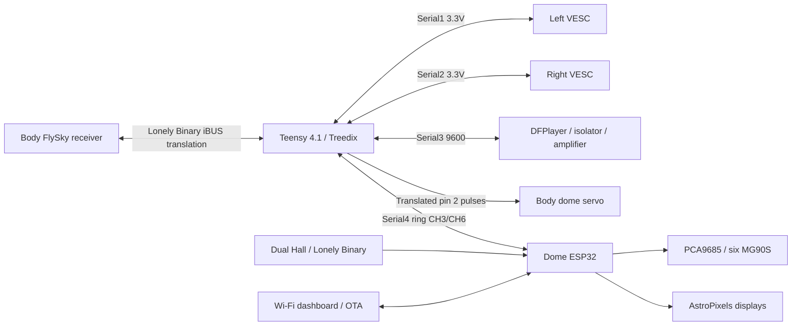

# R2-D2 System Architecture

> **Safety Notice:** Do not connect this wiring to the old ESP32-only firmware. Flash both the Teensy 4.1 body controller and the AstroPixels Plus ESP32 with the current firmware before combined testing; nothing counts as bench-verified until the commissioning record is filled in.

The selected first-assembly architecture splits real-time body control from dome lighting/choreography.

## Responsibilities

| Body: Teensy 4.1 / Treedix | Dome: AstroPixels ESP32 |
| --- | --- |
| FlySky SERVO iBUS decode and SENSOR half-duplex replies | Lighting, holo servos/PCA9685 |
| Differential mixing and two independent VESC UARTs | Two Hall sensors (Front/Rear) and published Hall state |
| Continuous dome-rotation servo | Macros, audio selection and chatter |
| Bidirectional DFPlayer UART and playback feedback | Wi-Fi UI, settings, OTA |
| RC freshness, drive arming, actuator leases and locks | Body requests, acknowledgements and operator status |

Motor, receiver, audio and dome-servo control do not cross the slip ring as separate signals. Two 3.3V UART lines carry framed body/dome requests, status and snapshots. Each board retains local actuator ownership; acknowledgements are required before the dashboard claims body actions completed.

## Power and ring

Battery 12.8V20Ah,20A continuous;25A main fuse -> master cutoff -> six-way12V fuse block. F1 shared VESC 15A, F3/F4 bucks7.5A, F5 amplifier5A; F2/F6 empty.

Each5V buck feeds the owned local terminal distribution. Four inline fuses: B-SERVO 5A, B-LOGIC 2A, D-SERVO 5A, D-LOGIC3A. Body/dome 5V positives remain separate; all grounds are common. No separate5V fuse boxes.

| Contact | BODY end | DOME end | Function |
| --- | --- | --- | --- |
| CH1 | F4 7.5A fused battery positive | Dome buck IN+ | Dome 12V feed |
| CH2 | Body ground bus | Dome ground / buck IN- | Common return |
| CH3 | Teensy TX17 | ESP32 GPIO16 | Body to dome serial |
| CH4 | Unconnected | Unconnected | Spare |
| CH5 | Unconnected | Unconnected | Spare |
| CH6 | Teensy RX16 | ESP32 GPIO17 | Dome to body serial |

CH4/5 ends are individually insulated. Native3.3V UART needs no shifter. Ring contacts are not paralleled.

## Motion and failure ownership

Teensy validates all 14 received channel fields, requires fresh RC <=250ms and both VESC feedback records <=500ms, then gates drive with CH6/SwA. After boot/fault, CH6 must be OFF -> ON and steering/throttle centered 500ms. Rates35/70/100% are normalized duty-command scales, not road-speed guarantees; absolute duty cap95%.

Neutral and disarm use positive brake-current commands, not zero duty. Each VESC has a 150ms command timeout and tested timeout braking. Neither firmware nor master cutoff guarantees a fixed mechanical stopping distance.

Manual dome control needs fresh radio and a saved, accepted servo neutral (until then the dome servo gets no signal); deflecting CH4 overrides any automatic dome action. Automatic home requires CH9 ON, centered dome stick and fresh Hall updates; manual override cancels it. Peer link loss cancels remote actions but does not unnecessarily stop healthy manual foot drive. Transmitter CH3 is unused; CH9 gates Auto Dome. STOP and maintenance locks are latched on the Teensy across peer loss and dome reboot until explicitly released/recovered (they live in Teensy RAM, so a Teensy power cycle starts unlocked); a release is refused, and changes nothing, until CH6 is OFF and the sticks have been centred 500ms. Only the operator STOP latches a body stop; routine dome actions never do. The Faint macro does not engage maintenance lock.

Audio timing uses DFPlayer feedback; command acknowledgement alone does not prove audible playback. Leia starts only after home completes and confirmed playback starts. OTA begins only after body acknowledges an all-motion maintenance lock.

## Assembly authority and implementation status

| Document | Purpose |
| --- | --- |
| [Body Controller Wiring](BODY_CONTROLLER_WIRING.md) | Authoritative Teensy terminals, receiver/shifter and UART harnesses |
| [Power Harness](POWER_HARNESS_GUIDE.md) | Approved fuses, distribution, gauges, audio and charging |
| [Dome Wiring](DOME_WIRING_DIAGRAM.md) | ESP32, PCA9685 and lighting connections |
| [VESC Drive Setup](VESC_DRIVE_INTEGRATION.md) | Independent controller configuration and motor commissioning |
| [Commissioning](BODY_CONTROLLER_COMMISSIONING.md) | Unpowered, USB, subsystem and failure acceptance sequence |
| [Controller Operator Guide](CONTROLLER_OPERATOR_GUIDE.md) | Switch/stick layout, routine dial schedule, and power-on checklist |
| [BOM](Master_R2D2_BOM.xls) | Selected/owned/ordered/unused inventory |
| [Inspector](wiring_visualizer.html) | Terminal graph and printable wire schedule |
| [Firmware plan](docs/superpowers/plans/2026-10-09-teensy-firmware.md) | Implemented; host unit and two-board integration tests passing; hardware not yet commissioned |

Firmware migration is implemented and host-tested; hardware behaviour is verified only by the commissioning record. Mechanical mount files remain work-in-progress; verify fit, axle retention, leg clearance and dome coupler before powered tests.
