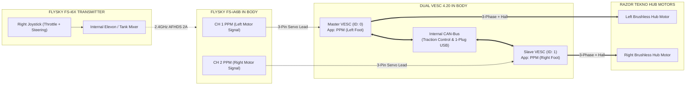

# Direct RC Dual VESC 4.20 Setup & Tuning Guide
## (Transmitter Elevon Mixing + Safety Current Limits + CAN-Bus Sync)

This guide covers wiring, safety current limits, and VESC Tool setup to run your **Dual VESC 4.20** directly from your **FlySky FS-iA6B Receiver** with **Transmitter-Side Elevon Mixing** and **CAN-Bus Traction Control**.

---

## 1. Direct RC Architecture Overview

The **FlySky FS-i6X Transmitter** mathematically mixes Forward/Reverse (Throttle) and Left/Right (Steering) into differential drive signals, sending separate PPM pulses to the Master (Left) and Slave (Right) VESCs:

---

## 2. Wiring Connections

| From Device | To Device / Port | Wire Function | Notes |
| :--- | :--- | :--- | :--- |
| **Battery (+) via Master Switch** | **Dual VESC B+ Terminal** | 12V Main DC Power | Heavy 12–14 AWG wire |
| **Battery (-) Common Ground** | **Dual VESC B- Terminal** | Main DC Ground | Heavy 12–14 AWG wire |
| **VESC 3-Pin Header** | **Illuminated Latching Push Button** | Anti-Spark Soft Switch | Tier 2 Motor Drive Enable |
| **FlySky Receiver CH1** | **Master VESC PPM Port** | Left Foot PPM Signal ($1000\mu\text{s}-2000\mu\text{s}$) | Standard 3-pin servo patch cable |
| **FlySky Receiver CH2** | **Slave VESC PPM Port** | Right Foot PPM Signal ($1000\mu\text{s}-2000\mu\text{s}$) | Standard 3-pin servo patch cable |
| **FlySky Receiver 5V & GND**| **10A Buck 5V & GND** | Receiver Power In | Red (+) & Black (-) wires *(Do NOT use VESC 5V BEC)* |

---

## 3. FlySky FS-i6X Transmitter Setup (30-Second Setup)

### Step 1: Enable Elevon / Tank Mixing
1. Turn on the transmitter.
2. Hold **OK** to enter the Menu $\rightarrow$ Select **Functions Setup** $\rightarrow$ Scroll to **Elevon**.
3. Set:
   * **`Elevon`**: `On`
   * **`CH1`**: `+100%` *(Set to `-100%` if steering direction is reversed)*
   * **`CH2`**: `+100%`
4. **Hold CANCEL for 3 seconds to save**.

### Step 2: Configure 3-Speed Profiles (Dual Rates on Switch `SwB`)
1. In **Functions Setup**, scroll to **Dual rate/exp.**:
   * Select **Channel 1 (Steering)** & **Channel 2 (Throttle)**.
   * Assign Switch to **`SwB` (3-Position Switch)**.
2. Configure the 3 rates:
   * **Position 1 (UP - Indoor / Crowd Slow Mode)**: `Rate = 35%`, `Exp = +15%` *(Super smooth)*.
   * **Position 2 (MID - Normal Cruising Mode)**: `Rate = 70%`, `Exp = 0%` *(Standard walking pace)*.
   * **Position 3 (DOWN - Full Outdoor Speed Mode)**: `Rate = 100%`, `Exp = -10%` *(Full motor power)*.
3. **Hold CANCEL for 3 seconds to save**.

---

## 4. VESC Tool Configuration (Step-by-Step)

Plug your USB cable into the **Master VESC** and open **VESC Tool**:

### Step 1: Motor FOC & Hall Sensor Detection (Both Motors)
1. Run the **Motor Setup Wizard** on Master:
   * **Motor Type**: `FOC (Field Oriented Control)` *(Whisper quiet)*.
   * **Sensors**: `Hall Sensors`.
   * Run **RL Detection & Hall Detection**. Apply and save results.
2. Toggle **"CAN Forward"** on the right side of VESC Tool and run the wizard for the **Slave** motor.

---

### Step 2: Safety Current Limits (Protects VESC 4.20 & Battery)

Under **Motor Settings $\rightarrow$ General $\rightarrow$ Current** (Configure on **BOTH** Master and Slave):

| VESC Tool Parameter | Setting Value | Purpose & Rationale |
| :--- | :---: | :--- |
| **`Battery Current Max`** | **`12.0 A`** | **Caps DC draw from the battery to 12A per motor.** Both feet combined will draw a maximum of $24.0\text{A}$, safely under your Renogy battery's $20\text{A}$ continuous / $75\text{A}$ surge limit. |
| **`Battery Current Max Regen`** | **`-5.0 A`** | Caps regenerative braking current returned to the LiFePO4 battery during braking. |
| **`Motor Current Max`** | **`18.0 A`** | Caps phase current (low-speed torque) to protect the Razor hub motor windings from overheating. |
| **`Motor Current Max Brake`** | **`-15.0 A`** | Provides smooth, progressive braking without sudden jerky wheel lockups. |
| **`Absolute Maximum Current`** | **`28.0 A`** | Hardware overcurrent fault trip threshold (safely protects VESC MOSFETs from short circuits). |

---

### Step 3: CAN-Bus Configuration (1-Plug USB & Traction Control)
1. On **Master VESC**:
   * **General $\rightarrow$ General**: Set `Controller ID = 0`.
   * `CAN Baud Rate = 500K`.
   * `CAN Status Message Mode = CAN_STATUS_1_2_3_4_5`.
2. On **Slave VESC** (via CAN Forward):
   * **General $\rightarrow$ General**: Set `Controller ID = 1`.
   * `CAN Baud Rate = 500K`.
   * `CAN Status Message Mode = CAN_STATUS_1_2_3_4_5`.

---

### Step 4: PPM App Settings (Configured on BOTH Master & Slave)
1. On **Master VESC**:
   * **App Settings $\rightarrow$ General**: Set `App to Use = PPM`.
   * **App Settings $\rightarrow$ PPM $\rightarrow$ General**:
     * `Control Type = Duty Cycle` *(Directly maps stick position to wheel RPM for tank-style steering)*.
     * `Traction Control = True` *(Prevents wheel slip on slick floors)*.
     * `Multiple ESCs over CAN = False` *(Disabled: Each VESC reads its own PPM lead)*.
   * **App Settings $\rightarrow$ PPM $\rightarrow$ Mapping**:
     * Click **Measure PPM** $\rightarrow$ Move right stick $\rightarrow$ Apply measured pulses ($1.05\text{ms}$ to $1.95\text{ms}$).
2. Repeat on **Slave VESC** (via CAN Forward).
