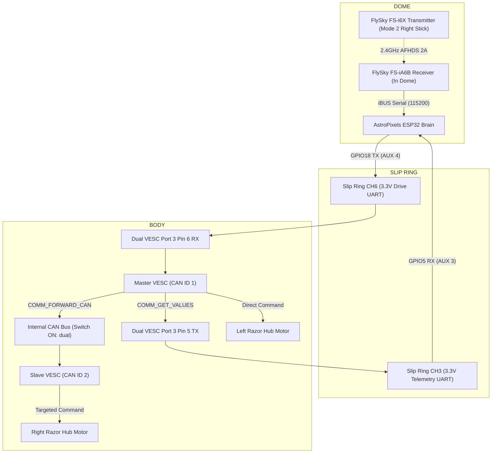

# Dual VESC 4.20 UART & Internal CAN Setup Guide

This guide covers setting up the Flipsky Dual FSESC 4.20 speed controller to drive the Razor Tekno Pop hub motors in R2's feet. The motors are driven directly from the **Dome ESP32** over a single serial line through the slip ring, using the controller's internal CAN bus to link both wheel channels.

---

## 1. Drive Architecture Overview

The FlySky radio receiver sits in the dome and streams all joystick channels to the ESP32 over digital iBUS. The ESP32 handles differential tank mixing, speed scaling, and deadbands in firmware, then sends digital VESC packets down **Slip Ring Channel 6** to the Dual VESC in the body.

The Dual VESC's onboard switch is set to **`ON: dual`**, bridging both halves over their internal CAN bus:
* **Left Motor:** Driven directly by the Master controller (CAN ID 1).
* **Right Motor:** Driven by the Slave controller (CAN ID 2) via VESC CAN forwarding (`COMM_FORWARD_CAN`).

No extra body microcontroller, Arduino, or level shifter is needed.



---

## 2. Physical Wiring & Pinout

### Dual VESC Port 3 (`COMM`) Pinout

Two signal wires and one ground wire connect to the 7-pin Port 3 (`COMM`) on the Master side:

```
  Top of Port 3 (COMM)
  ┌───────────────┐
  │ 1. 5V         │  --> LEAVE DISCONNECTED (Never backfeed VESC 5V to slip ring)
  │ 2. 3.3V       │  --> LEAVE DISCONNECTED
  │ 3. - (GND)    │  --> Connect to 12V Fuse Box Negative Bus
  │ 4. ADC        │  --> LEAVE DISCONNECTED
  │ 5. TX         │  --> Connect to Slip Ring CH3 (to ESP32 GPIO5 AUX 3 for telemetry)
  │ 6. RX         │  --> Connect to Slip Ring CH6 (from ESP32 GPIO18 AUX 4 for drive)
  │ 7. ADC2       │  --> LEAVE DISCONNECTED
  └───────────────┘
```

| Port / Connection | Terminal | Destination | Purpose |
| :--- | :--- | :--- | :--- |
| **Battery Leads (12AWG)** | Shared (+) Red | Fuse F1 (15A) | 12V DC power for both motor channels |
| **Battery Leads (12AWG)** | Shared (&minus;) Black | Fuse Box Negative Bus | Common system ground return |
| **Port 3 (`COMM`) Pin 6** | `RX` (3.3V) | Slip Ring CH6 (body side) | Incoming 115,200-baud VESC drive command stream |
| **Port 3 (`COMM`) Pin 5** | `TX` (3.3V) | Slip Ring CH3 (body side) | Outgoing 115,200-baud VESC telemetry stream to dome ESP32 |
| **Port 3 (`COMM`) Pin 3** | `-` (GND) | Fuse Box Negative Bus | Signal reference ground |
| **Hardware Toggle Switch** | Slide Switch | **`ON: dual`** | Bridges internal CAN bus traces between Master & Slave |
| **Master Port 2 (`SENSE`)** | 6-pin JST | Left Motor Hall bundle | Motor commutation sensors |
| **Slave Port 2 (`SENSE`)** | 6-pin JST | Right Motor Hall bundle | Motor commutation sensors |

> [!CAUTION]
> **Never connect Pin 1 (5V) or Pin 2 (3.3V) on Port 3.** The VESC generates its own internal logic voltages. Connecting these pins to the slip ring or ESP32 can damage both boards.

### Motor Hall Sensor Pinout (Port 2)
Plug each motor's 5-wire Hall bundle into its channel's 6-pin JST port:
1. **GND** &rarr; Black (Sensor ground)
2. **H3** &rarr; Green (Hall signal 3)
3. **H2** &rarr; Blue (Hall signal 2)
4. **H1** &rarr; Yellow (Hall signal 1)
5. **TMP** &rarr; *Unused* (insulate lead)
6. **5V** &rarr; Red (Hall sensor power)

---

## 3. VESC Tool Configuration & Motor Detection

Always prop the droid up on a stand so **both drive wheels spin freely in the air** during configuration and testing.

Connect a micro-USB cable to each controller port one at a time:

### Step 1: Master Controller Setup (Left Wheel)
1. Plug USB into the **Master side USB port** and open **VESC Tool**.
2. Connect and backup default settings.
3. Open **App Settings &rarr; General**:
   * **App to Use:** `UART`
   * **Controller ID:** `1`
   * **Send Status over CAN:** `True`
   * **Multiple ESCs over CAN:** `True`
   * **CAN Baud Rate:** `CAN_BAUD_500K`
   * **Timeout:** `150 ms` (motors shut down if serial packets stop)
4. Open **App Settings &rarr; UART**:
   * **Baudrate:** `115200 bps`
5. Write App Configuration (down-arrow icon with "A").

### Step 2: Slave Controller Setup (Right Wheel)
1. Plug USB into the **Slave side USB port** (or use CAN forwarding within VESC Tool).
2. Connect and backup default settings.
3. Open **App Settings &rarr; General**:
   * **App to Use:** `UART` (or `No App`)
   * **Controller ID:** `2`
   * **Send Status over CAN:** `True`
   * **CAN Baud Rate:** `CAN_BAUD_500K`
   * **Timeout:** `150 ms`
4. Write App Configuration.

### Step 3: Motor Current Limits & FOC Detection (Both Sides)
Configure safe current limits for the Razor hub motors:

| Parameter | Recommended Setting | Rationale |
| :--- | :---: | :--- |
| **`Battery Current Max`** | **`5.0 A`** | Caps battery draw to 10A combined, safely below the 20A battery rating. |
| **`Battery Current Max Regen`** | **`-2.5 A`** | Caps regenerative braking current safely for LiFePO4 cells. |
| **`Motor Current Max`** | **`12.0 A`** | Prevents motor winding overheating during sustained turns. |
| **`Motor Current Max Brake`** | **`-5.0 A`** | Smooth, controlled stopping force without jerky tire skidding. |

Run the **FOC Motor Detection Wizard** on both sides:
1. Select **Hall Sensors**.
2. Run automated $R$, $L$, and flux linkage detection (wheels spin briefly).
3. Run Hall sensor mapping (wheels rotate slowly in one direction).
4. Apply and write motor settings.

---

## 4. Firmware Tank Mixing & Control

The dome ESP32 runs `processVescDrive()` in its main loop every 20ms (50Hz):

1. **Stick Inputs:**
   * Right Stick Y (CH2): Forward / Reverse throttle (`1000us` to `2000us`).
   * Right Stick X (CH1): Left / Right differential steering (`1000us` to `2000us`).
2. **Deadband:**
   * `1460us` to `1540us` is treated as neutral `0.0`. Eliminates motor hum or crawl when the spring-centered stick is at rest.
3. **Dual Rates (Speed Switch SwB):**
   * **Position 1 (Slow):** 35% speed — crowd navigation and indoor maneuvering.
   * **Position 2 (Medium):** 70% speed — outdoor cruising.
   * **Position 3 (Fast):** 100% speed — wide open areas.
4. **Tank Mixing:**
   $$\text{Left Duty} = (\text{Throttle} + \text{Steer}) \times \text{Rate}$$
   $$\text{Right Duty} = (\text{Throttle} - \text{Steer}) \times \text{Rate}$$
   * Moving the stick diagonally curves smoothly into turns.
   * Pushing the stick hard left/right with zero throttle counter-rotates the wheels for instant 360° spins in place.
5. **Failsafe Actions:**
   * If the radio signal drops (`rc_connected == false`), the ESP32 sends `0.0` duty to both motors immediately.
   * If the slip ring contact is broken, the VESC's internal `150ms` timeout kicks in and halts the motors.
   * When the Faint macro (`:SE06`) triggers, the ESP32 cuts motor power automatically.
6. **Telemetry Feedback & Auto-Protection:**
   * `requestVescTelemetry()` polls the Master VESC at 5Hz using `COMM_GET_VALUES`.
   * `processVescTelemetry()` decodes the incoming response stream over Slip Ring CH3 on ESP32 GPIO5 (AUX 3).
   * **Low-Voltage Cutoff:** If battery voltage drops below 10.5V (and > 5.0V), firmware forces motor duty to `0.0` to prevent over-discharging the LiFePO4 cells.
   * **Fault Cutoff:** If the VESC reports any non-zero fault code (`FAULT_CODE_DRV`, `FAULT_CODE_OVER_TEMP_FET`, `FAULT_CODE_UNDER_VOLTAGE`), motor duty is immediately forced to `0.0`.

---

## 5. Bench & Floor Testing Procedure

### Bench Test (Wheels Elevated)
1. Turn on the transmitter with sticks centered.
2. Power on R2's master battery switch.
3. Gently push throttle forward: both wheels must spin forward.
4. Pull throttle backward: both wheels must spin backward.
5. Push stick full right: left wheel spins forward, right wheel spins backward.
6. Push stick full left: left wheel spins backward, right wheel spins forward.
7. **Failsafe Test:** While wheels are spinning forward, turn off the FlySky transmitter. Both wheels must stop within 250ms. Turn transmitter back on.

### Floor Test
1. Place R2 on a smooth, level floor.
2. Set switch `SwB` to **Position 1 (Slow)**.
3. Practice gentle straight lines, slow turns, and spins in place.
4. Confirm smooth stopping when releasing the stick.
5. After 5 minutes, feel the wheel hubs and Dual VESC casing—they should be barely warm.
