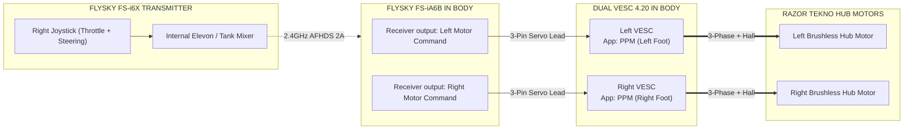

# Direct RC Dual VESC 4.20 Setup & Tuning Guide
## (Transmitter Tank Mixing + Independent VESCs + Drive Failsafes)

This guide covers the agreed starting configuration for the Dual Flipsky FSESC4.20, FlySky FS-i6X transmitter and FS-iA6B receiver. The transmitter mixes tank drive; each VESC receives its own left/right command. The hardware slave-mode toggle is OFF, so the VESCs do not mirror commands over CAN.

---

## 1. Direct RC Architecture Overview

The **FlySky FS-i6X Transmitter** mixes forward/reverse and steering into separate left/right drive commands. Use the normal Mode 2 right stick (vertical for throttle, horizontal for steering); the exact channel assignments and signs must be verified with the receiver channel monitor before connecting motors:

---

## 2. Wiring Connections

| From Device | To Device / Port | Wire Function | Notes |
| :--- | :--- | :--- | :--- |
| **Switched fuse-box F1** | **Shared dual VESC positive factory lead** | Nominal12V power for both channels | One15A branch;12AWG added extension <=1m; rated gauge-matched crimp splice, no factory connector |
| **Fuse-box negative bus** | **Shared dual VESC B- input** | Return for both channels | One12AWG added extension <=1m; no negative fuse |
| **Receiver left-motor output** | **Left VESC PPM input** | Mixed drive command | Standard 3-pin servo lead; verify signal and ground orientation |
| **Receiver right-motor output** | **Right VESC PPM input** | Mixed drive command | Standard 3-pin servo lead; verify signal and ground orientation |
| **Body buck 5V & GND** | **Receiver power input** | Receiver supply | Do not parallel unrelated 5V outputs |
| **VESC slave-mode toggle** | **OFF** | Independent controllers | No master/slave command mirroring; no button is connected to the VESC |

Use the [approved harness schedule](POWER_HARNESS_GUIDE.md): the user confirms **one shared bare-wire battery input pair** for the whole dual controller. F1 provides one15A branch on12AWG extensions; F2 is unused with no fuse installed. Do not split the supply externally or parallel fused outputs. Verify factory lead polarity/gauge and use appropriately rated gauge-matched terminations;15A is a starting fuse choice requiring startup/inrush checks. Main protection remains25A on10AWG; motor phase extensions remain12AWG at2m per motor. Shared power does not imply shared commands: both receiver inputs remain independent with slave toggleOFF.

The actual unit has **one micro-USB port per controller**, bare three-phase motor leads per channel, and a six-pin JST Hall connector per channel. Configure each channel through its own USB port, one at a time, without CAN forwarding. Use a data-capable micro-USB cable. Plan to supply battery power for VESC Tool access; USB-only operation is not established. First connection is read-only: record firmware/hardware versions and export motor/application settings before writing changes. This powered identification session is separate from motor detection: do not update firmware or run detection to obtain identification. Follow the first-power precautions in Section 4.

### Actual Hall adapter order

The user reports this order **top to bottom in their observed orientation**, for each six-pin Hall connector:

| Observed position | Controller terminal | Motor lead / action |
| --- | --- | --- |
| 1, top | GND | Black Hall ground |
| 2 | H3 | Green Hall signal, initial assignment |
| 3 | H2 | Blue Hall signal, initial assignment |
| 4 | H1 | Yellow Hall signal, initial assignment |
| 5 | TMP | Unused; insulate loose adapter lead |
| 6, bottom | 5V | Red Hall supply |

These position numbers are a record of the user's view, **not a manufacturer's pin-number convention**. Mark which end is5V/GND and preserve the same viewing orientation; a plug mating-face view can mirror a socket view. Do not repin based on "top" alone without an orientation reference. Confirm the motor supply polarity; Hall detection learns the initial H1/H2/H3 permutation but does not correct a swapped supply. Connect with battery/USB disconnected. The Hall5V source is the VESC, not the body buck, battery or ESP32 shifter.

**Receiver supply:** the body buck powers the receiver. Each VESC PPM connection carries **signal and ground only**; remove and insulate its +5V/red conductor so the VESC BEC outputs cannot parallel the body buck. The separate motor-Hall adapter still supplies the motor's Hall sensors from the controller's Hall5V/GND pins. Keep the five-wire Hall bundle apart from the three phase wires where practical and leave temperature unconnected.

The master battery disconnect is the physical power-off device. It is not a substitute for neutral failsafe and VESC input-timeout setup.

---

## 3. FlySky FS-i6X Transmitter Setup

### Step 1: Configure and verify transmitter-side tank mixing
**Status:** FS-i6X menu names, installed transmitter firmware and mix/rate capabilities have not yet been checked. This is the required setup and acceptance sequence, not a verified button-by-button recipe. Do not select an aircraft mix merely because its name sounds suitable.

1. Record transmitter firmware and model-memory name; use a dedicated R2 model memory. Preserve the receiver channels already allocated to dome/macros.
2. Use the spring-centred Mode 2 right stick: vertical is forward/reverse throttle and horizontal is steering. Disable drive trims or leave them at zero; do not use trim as a moving neutral adjustment.
3. Identify and record the actual two receiver PWM outputs available for left/right drive. The CH1/CH2 names in the architecture sketch are logical assignments pending this check. Confirm the transmitter can produce the required mixed outputs without disturbing the other controls.
4. With motors disconnected, use the transmitter output monitor and, when powered, each VESC's received-pulse monitor to verify the table below. Transmitter monitor values alone do not establish the pulses actually received by the controller.
5. Correct mix signs/channel reversal as needed. Check full-stick combinations for clipping, unexpected asymmetry and output outside the configured endpoints. Label the final receiver outputs and save the model.

| Right-stick action | Required left wheel command | Required right wheel command |
| --- | --- | --- |
| Centre | Neutral, with gentle braking required at the VESC | Neutral, with gentle braking required at the VESC |
| Forward, no steering | Forward | Forward |
| Reverse, no steering | Reverse | Reverse |
| Right, no throttle | Forward | Reverse |
| Left, no throttle | Reverse | Forward |
| Forward + right | More forward than right | Less forward than left |
| Forward + left | Less forward than right | More forward than left |

"Forward" here means vehicle travel, not necessarily the same electrical rotation direction for mirrored foot motors. Verify the physical directions only after detection with wheels raised. Large steering inputs may reverse the inner wheel depending on the final mixer; characterize this before ground operation.

### Step 2: Proposed three-position drive-rate profiles, not yet verified

The intended `SwB` profiles are 35%, 70% and 100% command range. **Do not assume the FS-i6X supports three-position rates on the required mixed outputs.** Confirm its switch assignment, mix ordering and rate capability before prescribing menus or implementing these profiles. Leave expo unchanged until its sign convention and effect are verified.

Calibrate the VESC using the final full-range endpoints, not a reduced-rate profile, then verify the reduced profiles against that same mapping. Otherwise a calibration wizard may stretch the reduced range back to full command. Rate changes must preserve neutral on both sides.

These percentages are not measured speed limits. In current control they predominantly change torque demand; in duty control they change commanded duty, not closed-loop RPM. A 100% profile is not approved for ground use until commissioning establishes acceptable speed and stopping behaviour. If the transmitter cannot provide the intended profiles, stop and choose a supported alternative rather than silently omitting or approximating them.

---

## 4. VESC Tool Configuration (Step-by-Step)

Motor detection is a required commissioning task **after the motors, controllers and harness are installed and inspected**, not a prerequisite for assembling the unpowered harness. Powered identification can happen first; detection and driving remain on hold until their current settings and procedure are resolved.

### Step 1: First powered identification, without motor detection

1. With battery and USB disconnected, inspect shared-input polarity, fuse/termination ratings, insulation and mounting. Verify the slave-mode toggle is OFF.
2. For this identification-only session, leave both motors' phase/Hall leads and both receiver PPM inputs disconnected and individually insulated. This prevents an unknown saved application configuration from commanding the installed motors.
3. Secure the controller on a nonconductive surface with ventilation and access to the master cutoff. Energize it through the approved fused battery harness, then connect one controller's micro-USB port using a data cable. Stop and isolate power for abnormal heat, smell, smoke or a fuse/BMS trip; investigate rather than increasing a fuse.
4. Read and record the hardware/firmware identifiers and export that channel's motor/application settings. Do not accept a firmware-update prompt, start a setup wizard that runs detection, or write settings just to identify the unit.
5. Repeat for the other USB port, one at a time, without CAN forwarding. If VESC Tool cannot read the installed firmware, stop and resolve compatibility rather than upgrading blindly.
6. Disconnect USB and switch off/isolate battery power before changing wiring. Allow capacitors to discharge and verify absence of voltage before handling power terminals.

### Step 2: Establish current limits and the detection procedure

**Phase current** is current in the motor's three phase leads and windings. It governs torque and winding heating; it is not the same as battery current. At low speed, phase current can substantially exceed battery current because the controller switches the supply to regulate winding current. At standstill, electrical power delivered to the motor mostly becomes heat rather than useful motion.

The approximate **12V / 100W** motor rating therefore does not establish a safe phase-current limit. Dividing watts by battery voltage estimates a battery-side current under particular conditions, not allowable winding current. Neither the 5A battery setting nor the shared 15A fuse protects against every motor overheating condition.

Resolve the following before running detection:

1. Seek the exact motor specification, ideally continuous and short-duration motor-current limits. An original scooter-controller current rating is useful only if it is identified as battery current or motor current.
2. Use the recorded VESC firmware to identify the supported detection procedure and its explicit detection-current settings. **Do not assume normal running limits constrain every detection routine.** Confirm applicable limits before starting any wizard or RL/Hall test.
3. If authoritative motor data is unavailable, select and record a deliberately low commissioning motor-current limit and compatible detection parameters using documentation for that procedure. No numerical phase-current value is approved here yet; do not substitute an unsupported 18A value or infer one from wattage.
4. Treat any resulting setting as a conservative operating allowance, **not a measured absolute motor rating**. Detection identifies electrical parameters and Hall behavior; it does not establish continuous thermal capability.

Configure each controller separately. Values below remain provisional until checked against its firmware and the detection procedure:

| VESC Tool Parameter | Setting Value | Purpose & Rationale |
| :--- | :---: | :--- |
| **`Battery Current Max`** | **`5.0 A` per motor** | Conservative initial limit: up to 10A combined for both drive controllers, leaving nominal headroom under the battery's 20A continuous-discharge rating for accessories. This does not prove the total system stays below 20A; measure total battery current under realistic use. |
| **`Battery Current Max Regen`** | **`-2.5 A` per motor** | Limits combined regenerative charge current to 5A, below the battery's stated 10A recommended charge current. Confirm the exact battery/BMS charge limits before enabling regen. |
| **`Motor Current Max`** | **`TBD before detection or driving`** | Resolve the low commissioning allowance and detection current as described above. Powered read-only identification with motors disconnected is permitted first. |
| **`Motor Current Max Brake`** | **`-5.0 A` proposed, not yet approved** | Braking also heats motor windings. Check this magnitude against the selected motor-current allowance and firmware's sign convention before enabling it; validate stopping distance and temperature before increasing it. |
| **`Absolute Maximum Current`** | **Leave at documented default** | This setting is not a substitute for the battery fuse or branch protection; do not change it without the exact VESC documentation. |

These are commissioning starting values, not validated performance limits. A 5A battery-current limit is not an RPM or speed governor and does not establish that the droid can climb the target ramp.

The 5A-per-motor setting alone does not guarantee the battery stays below 20A. At full output, two 10A/5V converters could draw about 9–10A combined from a 12V battery (depending on efficiency), before the audio amplifier and other loads. Measure total battery current with realistic lighting, servo and audio activity; if it approaches the battery's continuous limit, reduce drive current or accessory load.

### Step 2A: Required motor detection after installation

1. With battery and USB disconnected, connect the inspected phase/Hall harnesses. Secure axle mounts and support the droid so both wheels are clear and cannot contact anyone or anything. Keep receiver PPM commands disconnected during detection.
2. Reconnect power and one USB port. With slave mode OFF, configure that channel for FOC and Hall sensors using the verified firmware-specific procedure and approved detection-current settings. Detection may rotate or jerk the wheel; keep clear.
3. Run the required resistance/inductance and Hall detection, review the results and faults, then apply/save only that motor's results. Stop for failed detection, rough motion or abnormal heating; do not respond by blindly raising current.
4. Repeat independently for the other channel through its own USB port. Do not use CAN forwarding. If independent configuration is unavailable, stop and resolve the hardware/tooling constraint.
5. Re-read saved settings and record detection results and final current limits for each side. Check that a wizard has not replaced the agreed battery or motor-current settings before enabling RC control.

### Step 2B: Validate the operating allowance under load

After input calibration and both failsafe tests, begin with smooth, low-current wheel-raised operation. This confirms basic operation, **not loaded thermal suitability**. Progress to short, slow tests on clear, level ground while recording motor current, battery current, faults and motor/controller temperatures. Do not deliberately stall a wheel or use the target ramp as the first load test.

Increase torque allowance only in small, documented steps if needed, within known hardware limits. Then validate sustained representative operation, including starts and turns and realistic accessory loads. The motor TMP connection is unused: external hub temperature can lag hotter internal windings, so a cool case after a short run is not proof of thermal safety. Use additional margin and obtain suitable temperature criteria from motor data or qualified assessment; no universal safe case temperature or test duration is established here.

Stop for faults, abnormal heating, hot wiring or a fuse/BMS trip. If adequate torque requires escalating current without trustworthy thermal limits, stop and obtain better motor data rather than continuing to increase it.

---

### Step 3: Keep slave mode disabled
Leave the physical slave-mode toggle OFF. Do not configure the controllers to mirror commands over CAN; each controller must respond only to its own receiver output. CAN is not part of the agreed drive-control architecture.

---

### Step 4: PPM input and loss-of-signal safeguards (both controllers)

**User-selected behaviour:** releasing the stick to centre must apply gentle braking, not simply coast. Forward and reverse must both be available. This is a required behaviour, not evidence that a particular VESC mode provides it. Electrical braking is not a parking brake or guaranteed stationary hold.

#### A. Select the supported bidirectional control mode

1. After firmware identification, select the PPM application and disable multi-controller/CAN command forwarding on both channels, using that firmware's documented options.
2. Verify which control mode actually supports both signed forward/reverse commands and braking at neutral. Record its exact menu name and any neutral-braking option. A mode that uses negative stick solely for braking does not satisfy reverse; a bidirectional mode that coasts at zero does not satisfy the selected centre behaviour.
3. **Do not retain the former blanket `Duty Cycle` instruction.** Duty is not closed-loop RPM control and its neutral/braking behaviour is firmware-dependent. Current, duty and speed control have different handling; the final choice requires documentation and a wheel-raised test.
4. If the installed firmware cannot provide the required neutral braking with direct receiver input, stop and resolve the control design before ground operation. Do not claim timeout braking supplies centre-stick braking: valid neutral pulses may keep resetting the timeout.

#### B. Calibrate neutral and endpoints independently

1. With motor phases disconnected and insulated while inspecting inputs, connect receiver signal/GND only to each VESC. Make wiring changes with battery/USB disconnected. Keep the receiver powered from the body buck; remove/insulate VESC +5V conductors.
2. Use the final full-range transmitter profile. Record each channel's actual minimum, centre and maximum received pulse widths; do not copy one controller's values to the other or assume nominal 1000/1500/2000 microseconds.
3. Configure mapping from those measurements. Select a neutral deadband that covers observed centre jitter without requiring excessive stick travel; record the chosen value and units. Confirm releasing the stick from every direction reliably returns both channels to neutral.
4. Enable the documented safe-start/neutral-before-arm feature if available. Verify that startup with a non-neutral input cannot immediately drive a wheel. If unavailable, record the limitation and resolve the startup safeguard before ground use.
5. Save and re-read both application configurations. After detection/current approval, reconnect motors with power isolated, raise both wheels and verify forward, reverse and gentle centre braking at low commands. Return to neutral and stop before requesting the opposite direction during initial testing.

#### C. Configure and test receiver radio-loss failsafe

Set both mixed receiver outputs to their measured neutral values on transmitter loss. With wheels raised, test from a small forward command and separately from a small reverse command by switching the transmitter off. Observe received pulses, wheel response and stopping time for both controllers. The receiver must not hold the last drive command.

Restore the radio link with the stick centred and verify no unexpected restart. Do not assume the transmitter's failsafe display proves the receiver has applied it.

#### D. Configure and test VESC missing-input timeout separately

Record the firmware-specific timeout duration, brake-current setting and units for each controller. The duration must tolerate normal receiver timing but stop drive promptly on missing pulses; the brake current must stay within the approved motor allowance. No numerical timeout or timeout-brake setting is approved yet.

**Transmitter-off testing does not prove this timeout:** the receiver may continue sending valid neutral pulses. Arrange an accessible signal-only break/test switch in each PPM lead while all power is disconnected; keep receiver power and shared ground intact. With wheels raised and a small command applied, use that prepared break to remove one controller's input pulses without touching live power terminals. Confirm its input becomes absent, propulsion stops and the configured timeout braking acts. Repeat for the other controller. Restore the signal with the stick centred and check for unexpected restart.

Failure of either radio-loss or missing-input testing is a stop condition. Do not compensate for a failed safeguard by relying only on the other.

#### E. Validate braking with the battery and actual vehicle

Regeneration can raise supply voltage, especially with a fully charged battery or a BMS that stops accepting charge. A 2.5A-per-side regen limit alone does not guarantee safe full-battery braking. Verify the battery/BMS behaviour, VESC voltage limits and documented response to loss of charge acceptance before declaring braking suitable; do not deliberately provoke a BMS disconnect.

After both wheel-raised safeguards pass, measure low-speed stopping behaviour in a clear level area with access to the cutoff, then progressively validate representative loads. Do not use a slope or crowded area until stopping is demonstrated. The cutoff removes power but can also remove electrical braking; it is not an assured instant stop.

### Commissioning record required before ground driving

| Record for the actual hardware | Status |
| --- | --- |
| Transmitter firmware, model memory, mix menu/settings and final left/right outputs | Pending transmitter menu check |
| Full-range endpoints, optional switch rates and neutral preservation | Pending transmitter/receiver verification |
| Each VESC hardware/firmware and matching Tool version | Pending first fused battery-powered identification |
| Bidirectional control mode and centre-braking option | Pending firmware documentation and wheel-raised verification |
| Each channel's measured pulse minimum/centre/maximum, deadband and safe-start setting | Pending powered input calibration |
| Motor/detection/brake current limits, timeout duration and timeout-brake setting | Pending motor-current and firmware checks |
| Separate radio-loss and missing-input results, including recovery | Pending wheel-raised acceptance |
| Battery/BMS regen suitability and measured loaded stopping behaviour | Pending electrical and vehicle acceptance |
