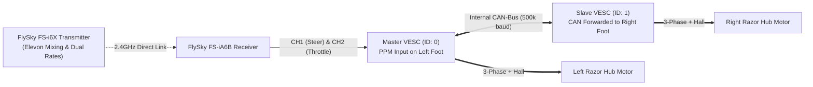

# Direct RC Dual VESC 4.20 Setup & Tuning Guide
## (Master/Slave CAN-Bus + Safety Current Limits + Transmitter-Side Speed Limiting)

This guide covers wiring, safety current limits, and VESC Tool setup to run your **Dual VESC 4.20** directly from your **FlySky FS-iA6B Receiver** over CAN-Bus.

---

## 1. Direct RC Architecture Overview

The **FlySky Receiver** outputs PPM drive signals directly to the Dual VESC Master, which syncs with the Slave over internal CAN-Bus:

---

## 2. Wiring Connections

| From Device | To Device / Port | Wire Function | Notes |
| :--- | :--- | :--- | :--- |
| **Battery (+) via Master Switch** | **Dual VESC B+ Terminal** | 12V Main DC Power | Heavy 12–14 AWG wire |
| **Battery (-) Common Ground** | **Dual VESC B- Terminal** | Main DC Ground | Heavy 12–14 AWG wire |
| **VESC 3-Pin Header** | **Illuminated Latching Push Button** | Anti-Spark Soft Switch | Tier 2 Motor Drive Enable |
| **FlySky Receiver CH1** | **Master VESC PPM Signal (`S`)** | Steering Signal | Yellow / White Wire |
| **FlySky Receiver CH2** | **Master VESC PPM Signal 2 / CH2** | Throttle Signal | Yellow / White Wire |
| **FlySky Receiver GND** | **VESC PPM GND (`-`)** | Common Ground | Black Wire |
| **FlySky Receiver 5V** | **10A Buck 5V Out** | Receiver Power In | Red Wire *(Do NOT use VESC 5V BEC)* |

---

## 3. VESC Tool Configuration (Step-by-Step)

Connect the Master VESC to your computer via USB and open **VESC Tool**:

### Step 1: Motor FOC & Hall Sensor Detection (Both Motors)
1. Run the **Motor Setup Wizard** on Master:
   * **Motor Type**: `FOC (Field Oriented Control)` *(Whisper quiet)*.
   * **Sensors**: `Hall Sensors`.
   * Run **RL Detection & Hall Detection**. Save results.
2. Repeat for the Slave motor.

---

### Step 2: Safety Current Limits (CRITICAL: Protects VESC 4.20 & Battery)

VESC 4.20 hardware uses the DRV8302 gate driver, which is delicate if overstressed. Setting conservative current limits protects the VESC hardware and guarantees you never exceed your Renogy battery's BMS.

Under **Motor Settings $\rightarrow$ General $\rightarrow$ Current** (Configure on **BOTH** Master and Slave):

| VESC Tool Parameter | Setting Value | Purpose & Rationale |
| :--- | :---: | :--- |
| **`Battery Current Max`** | **`12.0 A`** | **Caps DC draw from the battery to 12A per motor.** Both feet combined will draw a maximum of $24.0\text{A}$, safely under your battery limit and leaving plenty of headroom for dome lights and audio! |
| **`Battery Current Max Regen`** | **`-5.0 A`** | Caps regenerative braking current returned to the LiFePO4 battery. |
| **`Motor Current Max`** | **`18.0 A`** | Caps low-speed phase current/torque to protect the Razor hub motor windings. |
| **`Motor Current Max Brake`** | **`-15.0 A`** | Provides smooth, controlled braking without sudden wheel lockup. |
| **`Absolute Maximum Current`** | **`35.0 A`** | Hardware overcurrent fault trip threshold (protects VESC MOSFETs). |

---

### Step 3: CAN-Bus Configuration
1. On **Master VESC**:
   * **General $\rightarrow$ General**: Set `Controller ID = 0`.
   * Enable `Send Status over CAN = Enabled`.
   * `CAN Baud Rate = 500K`.
2. On **Slave VESC**:
   * **General $\rightarrow$ General**: Set `Controller ID = 1`.
   * Enable `Send Status over CAN = Enabled`.
   * Enable `Multiple ESCs over CAN = Enabled`.

---

### Step 4: PPM App Settings (Master VESC)
1. Go to **App Settings $\rightarrow$ General**:
   * Set **App to Use** to `PPM`.
2. Go to **App Settings $\rightarrow$ PPM $\rightarrow$ General**:
   * **Control Type**: `Duty Cycle` *(Directly maps stick position to wheel RPM for tank-style steering)*.
   * **Traction Control**: `True` (prevents wheel spin if one foot lifts or slips).
3. Go to **App Settings $\rightarrow$ PPM $\rightarrow$ Mapping**:
   * Turn on your FlySky transmitter and click **Measure PPM**.
   * Map center ($1.50\text{ ms}$), full forward ($1.95\text{ ms}$), and full reverse ($1.05\text{ ms}$).
   * Set **Deadband** to `0.05` (5%).

---

## 4. Transmitter-Side Speed Limiting (FlySky FS-i6X)

Instead of altering VESC firmware for different environments, configure **Dual Rates (D/R)** on your **FlySky FS-i6X** assigned to switch **`SwB` (3-Position Switch)**:

### Setting Up 3-Speed Profiles on the FlySky FS-i6X:
1. Hold **OK** $\rightarrow$ **Functions Setup** $\rightarrow$ **Dual rate/exp.**:
   * Select **Channel 1 (Steering)** & **Channel 2 (Throttle)**.
   * Assign Switch to **`SwB`**.
2. Set the 3 Speed Rates:
   * **Position 1 (UP - Indoor / Crowd Slow Mode)**:
     * `Rate = 35%`, `Exp = +15%` *(Super smooth, safe for tight conventions)*.
   * **Position 2 (MID - Normal Cruising Mode)**:
     * `Rate = 70%`, `Exp = 0%` *(Standard walking pace)*.
   * **Position 3 (DOWN - Full Outdoor Speed Mode)**:
     * `Rate = 100%`, `Exp = -10%` *(Full motor power)*.
3. Hold **CANCEL** to save.

Now you can flip `SwB` anytime while driving to change R2's maximum speed on the fly!
